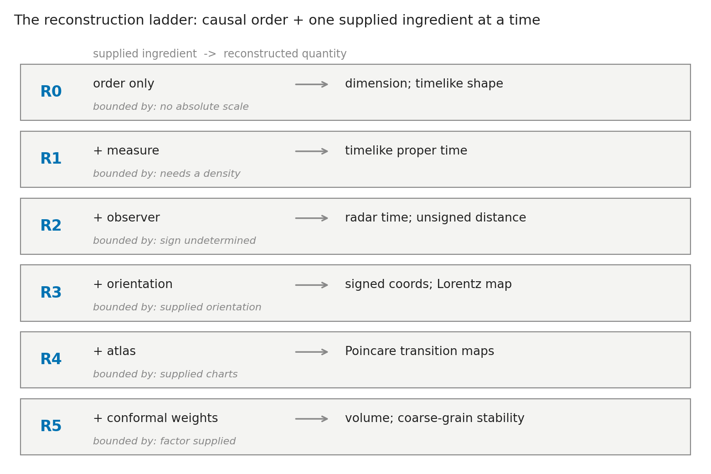
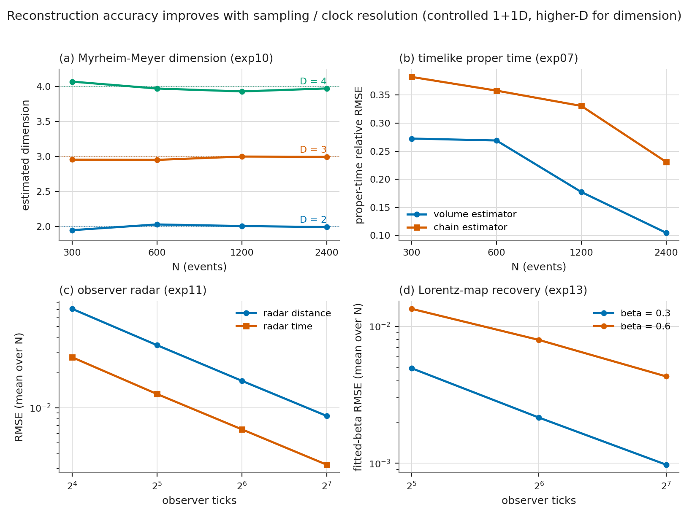
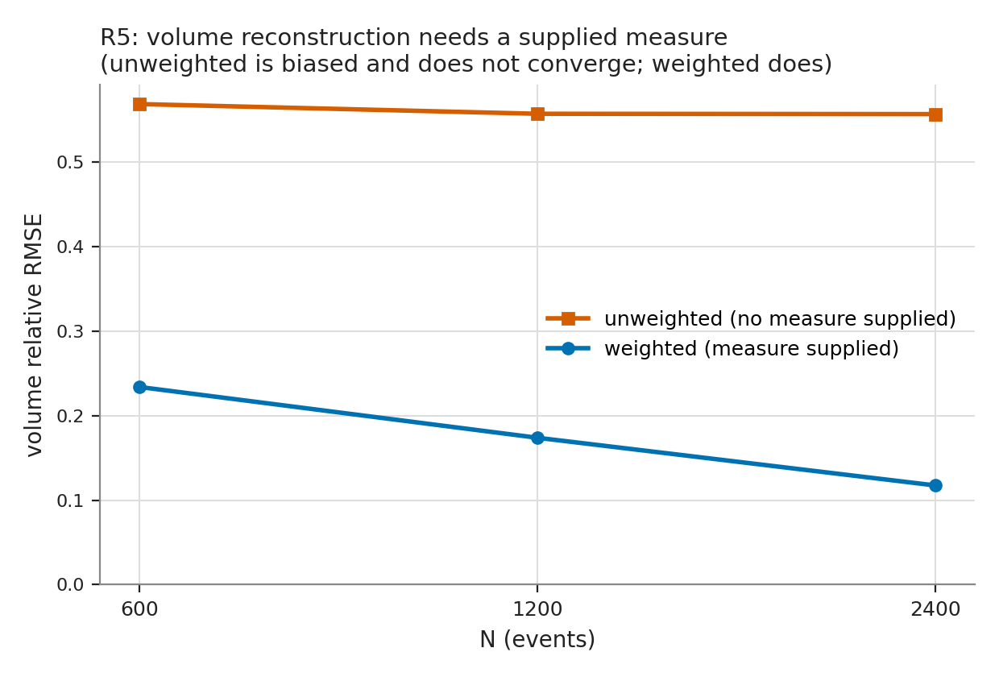

# An operational reconstruction ladder for spacetime quantities from causal order

**Draft v0.2.** Causal Spacetime Lab. Every quantitative result is grounded in
the experiment output CSVs (regenerable; each cited with its producing script);
no number is from memory.

## Abstract

We study, in controlled 1+1D (and, for dimension, higher-D) Minkowski models,
which spacetime quantities can be operationally reconstructed from a causal
(accessibility) order once a minimal, explicitly declared set of additional
ingredients is supplied. We organize the reconstructions as a ladder. From
causal order alone, order statistics recover the spacetime dimension and the
longest antichain-free chain fixes the *shape* of timelike separation, but not
its absolute scale. Adding a counting measure (event density) turns Alexandrov
interval cardinality into a timelike proper-time estimate whose error is
consistent with finite-sampling noise. Adding an observer chain with clock
labels yields radar time and unsigned radar distance; adding an orientation
reference lifts the reflection degeneracy to signed coordinates and lets one
recover the Lorentz map between two inertial protocols; adding overlapping
charts yields an observer atlas with approximately consistent Poincare
transition maps; adding conformal measure weights makes volume reconstruction
possible under the conformal ambiguity, and coarse-graining is stable only when
density is rescaled. We also give a Rindler horizon analogue, in which an
accelerated observer's two-way radar reconstruction is confined to the expected
wedge, and a finite-speed lattice counterexample showing that finite signal
speed alone does not produce Lorentzian structure. The contribution is not any
single reconstruction — most are standard — but the explicit accounting of what
each rung requires and the negative results that bound it. We make no claim
that spacetime is reducible to causal order; the reconstructions are controlled
validations inside known models.

## 1. Introduction

A conservative reading of the causal-set and order-first programs is that
causal order carries much, but not all, of Lorentzian geometry: with a volume
element it fixes geometry up to the well-understood conformal freedom
[@blms1987; @malament1977; @hkm1976; @kronheimer1967; @sorkin2005; @surya2019].
This paper treats that statement operationally and quantitatively. Rather than
ask whether spacetime "is" a causal set, we ask: fix a causal (or
null-accessibility) order in a known model; then, supplying one additional
ingredient at a time, which spacetime quantities can a finite procedure
actually reconstruct, with what error, and where does each reconstruction stop?

The value of posing it this way is an explicit *ledger*. Many individual
reconstructions here are standard — proper time from longest chains
[@brightwell1991], volume from interval cardinality [@blms1987], dimension from
ordering fractions [@myrheim1978; @meyer1988], radar coordinates from an
observer protocol. What is easy to lose, and what we make explicit, is exactly
which extra structure each requires and what remains underdetermined without it.
The ladder also isolates three instructive negative results: causal order alone
does not fix conformal scale; a single observer yields only unsigned distance
(a reflection degeneracy); and finite signal speed alone does not imply
Lorentzian structure.

Contributions: (1) a reconstruction ladder that indexes recoverable spacetime
quantities by the minimal supplied ingredient, with per-rung error behavior in
controlled models; (2) grounded validations of dimension, proper time, radar
decomposition, Lorentz-map and atlas consistency, and measure-dependent volume;
(3) three bounding negative results (conformal scale, reflection degeneracy,
finite-speed lattice); and (4) a Rindler reconstruction-inaccessibility
analogue. All results are controlled validations, not evidence that geometry
reduces to order.

## 2. The reconstruction ladder

We separate the *primitive* from *supplied ingredients* and index rungs by the
minimal ingredient each requires.

Primitive:

- **Causal / accessibility order.** A strict partial order on events (in the
  continuum models, Minkowski causal precedence; null-inclusive).

Supplied ingredients, in increasing strength:

- **M — counting measure / event density.** A volume element, supplied as a
  density or a sampling process.
- **O — observer chain with clock labels.** A timelike chain carrying ordered
  tick labels (an operational clock), defining a radar protocol.
- **R — orientation reference.** A second synchronized chain with known
  separation, fixing a spatial side.
- **A — observer atlas.** Multiple overlapping observer charts.
- **W — conformal measure weights.** A supplied local volume weighting.

Rungs (minimal ingredient -> what is reconstructed):

| Rung | Ingredient | Reconstructed | Bounded by |
| --- | --- | --- | --- |
| R0 | order only | dimension; timelike *shape* (longest chain); conformal/causal structure | no absolute scale |
| R1 | order + M | timelike proper time (interval cardinality -> volume -> tau) | needs a density |
| R2 | order + O | radar time; unsigned radar distance | sign undetermined |
| R3 | order + O + R | signed coordinates; Lorentz map between protocols | supplied orientation |
| R4 | order + O + A | atlas transition maps (Poincare); invariant agreement | supplied charts |
| R5 | order + M + W | volume under conformal ambiguity; coarse-graining stability | conformal factor supplied |

Three negative results bound the ladder from below (Section 5): conformal scale
is not fixed by order alone (motivating M and W); a single observer gives only
unsigned distance (motivating R); and finite signal speed alone does not give
Lorentzian structure. Figure 1 summarizes the ladder.

*Figure 1. The reconstruction ladder. Each rung adds one supplied ingredient to
the primitive causal order and unlocks a reconstructed quantity, bounded by what
that ingredient does not supply. Reading top-down recovers operational geometry;
reading the "bounded by" column is the ledger of what each reconstruction
costs.*

## 3. Methods (verified foundation layer)

Natural units, c = 1. The foundation modules were checked for numerical
correctness against known results (sprinkling measure, Minkowski causal
precedence, longest-chain and interval-cardinality normalizations,
Myrheim-Meyer inversion, radar/Lorentz/Rindler formulas); this section states
the conventions the results depend on.

- **Sprinkling.** Events are sampled uniformly with respect to the Minkowski
  volume in a causal diamond (rejection sampling on the ball-volume slice;
  equivalently uniform in null coordinates). The 1+1D and D-dimensional
  diamonds and the 1+1D forward cone are provided.
- **Causal order.** For events (t, x), i precedes j iff t_j - t_i > 0 and
  (t_j - t_i)^2 - |x_j - x_i|^2 >= -atol (null-inclusive J+; strict in time,
  so irreflexive).
- **Longest chain.** Topological-sort longest-path DP on the order; the 1+1D
  proper-time normalization uses the Brightwell-Gregory constant
  (L ~ 2 sqrt(rho) tau, i.e. L ~ 2 sqrt(N/2) in a diamond), with an
  endpoint-inclusive counting convention and acknowledged finite-size
  corrections.
- **Interval cardinality.** The open Alexandrov interval count K between two
  events estimates volume V = K/rho; in 1+1D V = tau^2/2, so tau_est =
  sqrt(2K/rho).
- **Myrheim-Meyer dimension.** The ordering fraction (related pairs over all
  pairs) is inverted against the known f(d) curve to estimate spacetime
  dimension in flat Alexandrov intervals.
- **Radar coordinates.** For a supplied observer chain, tau_minus and tau_plus
  are the latest preceding and earliest succeeding tick labels; radar time is
  their mean and radar distance their half-difference. A single chain gives
  unsigned distance; a second oriented chain supplies the sign. Lorentz maps
  between two inertial protocols are fit on their overlap.
- **Rindler.** An accelerated (Rindler) observer in flat spacetime, with
  analytic two-way radar ticks; the reconstructible region is the Rindler
  wedge, with the horizon appearing as a reconstruction-inaccessibility
  boundary.
- **Conformal / measure.** Positive conformal rescalings preserve causal order
  while changing volume and clock scale; volume reconstruction then requires
  supplied measure weights, and coarse-graining (random thinning) is stable
  only with density rescaling.

## 4. Results

Each result is a controlled validation in a known model; we report the grounded
number and its producing script.

### 4.1 R0 — order alone

**Dimension.** The Myrheim-Meyer estimator recovers spacetime dimension in flat
Alexandrov intervals and converges toward the true value as N grows: for true
dimension 2 the estimate moves 1.95 -> 2.03 -> 2.01 -> 1.99 at N = 300, 600,
1200, 2400; for dimension 3, 2.96 -> 2.95 -> 3.00 -> 3.00; for dimension 4,
4.07 -> 3.97 -> 3.93 -> 3.97, with RMSE decreasing with N
(exp10; `outputs/data/dimension_reconstruction_summary.csv`).

**Timelike shape (longest chain).** The longest chain follows the
Brightwell-Gregory scaling L ~ sqrt(2 rho) tau, approached from below at finite
density: at rho = 300 the normalized length L/(sqrt(rho) tau) is 1.325 with
endpoints included and 1.085 with endpoints removed, versus the asymptotic
sqrt(2) ~ 1.414, giving a finite-size low bias (mean chain proper-time error
-0.127) (exp09; `outputs/data/longest_chain_calibration_summary.csv`). The
approach toward the asymptotic value with N is shown by the chain estimator's
error falling with N in Section 4.2. This fixes the *shape* of timelike
separation from order plus a density normalization, with O(1) endpoint and
finite-size corrections; absolute scale is not fixed by order alone.

### 4.2 R1 — order + measure: timelike proper time

With event density supplied, Alexandrov interval cardinality reconstructs
timelike proper time between internal pairs, tau_est = sqrt(2K/rho). The
volume-estimator relative RMSE falls from 0.273 at N = 300 to 0.105 at
N = 2400, and beats the chain estimator (0.382 -> 0.231) at every N (exp07;
`outputs/data/timelike_pair_reconstruction_summary.csv`). In a fixed-interval
sanity check the interval-cardinality estimate of tau = 2.0 is exact at every N
(absolute error 0.0), while the chain estimate converges toward it
(0.303 at N = 200 -> 0.0125 at N = 2000) (exp03;
`outputs/data/timelike_reconstruction_summary.csv`). The observed errors are
consistent with finite-sampling noise rather than bias or estimator error: the
ratio of reconstruction RMSE to the predicted Poisson standard deviation is
0.93-1.07 across N (binomial 1.00-1.14) (exp08;
`outputs/data/probe_pair_statistical_calibration_summary.csv`).

### 4.3 R2 — order + observer: radar time and unsigned distance

Given an observer chain with clock labels, radar time and unsigned radar
distance are reconstructed from causal accessibility; the error falls roughly
by half per doubling of tick resolution — radar-time RMSE from 0.027 at 16
ticks to 0.0033 at 128 ticks, radar-distance RMSE from 0.072 to 0.0085, with
the accessible fraction 1.0 throughout (exp11;
`outputs/data/discrete_radar_reconstruction_summary.csv`). A single observer
determines only unsigned distance (the reflection degeneracy of Section 5).

### 4.4 R3 — + orientation: signed coordinates and the Lorentz map

A second synchronized beacon chain with known separation supplies orientation,
lifting the degeneracy to signed 1+1D coordinates. The affine map recovered
between two oriented inertial protocols approaches the Lorentz boost, with the
fitted-beta RMSE falling with tick density: from 0.0070 at 32 ticks to 0.0016
at 128 ticks for beta = 0.3, and from 0.016 to 0.0061 for beta = 0.6 (again
about halving per tick doubling) (exp13;
`outputs/data/oriented_radar_lorentz_summary.csv`).

Figure 2 collects the convergence behavior of the first four rungs: dimension
recovery (a), timelike proper time (b), observer radar (c), and Lorentz-map
recovery (d).

*Figure 2. Reconstruction accuracy in controlled models. (a) Myrheim-Meyer
dimension converges to the true value for D = 2, 3, 4 as N grows (exp10).
(b) Timelike proper-time relative RMSE falls with N, the interval-volume
estimator beating the longest-chain estimator (exp07). (c) Observer radar time
and distance RMSE fall about by half per doubling of clock ticks (exp11).
(d) Recovered Lorentz beta RMSE falls with clock ticks for two boosts (exp13).
Panels (c, d) are means over N; axes are logarithmic where noted.*

### 4.5 R4 — + atlas: transition-map consistency

With overlapping observer charts, affine Lorentz/Poincare transition maps fit
on chart overlaps show approximately consistent composition and invariant
agreement, improving with tick density: the mean transition-map beta error
falls 0.0047 -> 0.0012 and the invariant-interval RMSE 0.050 -> 0.010 (ticks
32 -> 128), while loop closure (A -> B -> C versus direct A -> C) has a
beta-composition error of 0.0072 -> 0.0017 (exp14;
`outputs/data/observer_atlas_transition_summary.csv`,
`observer_atlas_loop_summary.csv`). On exact analytic input the same
transition/loop machinery recovers the maps to machine precision (beta error
~5.6e-17, RMSE ~4e-17) (exp15;
`outputs/data/exact_poincare_map_sanity.csv`).

### 4.6 R5 — + conformal measure: volume and coarse-graining

Positive conformal rescalings preserve causal order while changing volume and
clock scale: under constant (1.0/1.5/2.0) and sinusoidal rescalings the causal
matrix is unchanged and the reconstructed dimension is identical (2.020), while
the proper-time ratio tracks 1.0/1.5/2.0 and the volume ratio 1.0/2.25/4.0
(exp18; `outputs/data/conformal_order_ambiguity_summary.csv`). With supplied
measure weights, weighted volume reconstruction is unbiased and convergent
(relative RMSE 0.234 -> 0.118 with N), whereas the unweighted estimate is
biased low and non-converging (0.569 -> 0.557, bias ~ -0.29); the analytic
volume/proper-time formulas are verified to ~1e-7 (exp19, exp20;
`outputs/data/weighted_conformal_volume_summary.csv`,
`conformal_volume_exact_sanity.csv`). Under random thinning, density-rescaled
reconstruction is stable (volume RMSE 0.018 -> 0.009, dimension steady ~2.0)
while the uncorrected estimate blows up to RMSE 0.270 (bias -0.183) at 25%
retention (exp23; `outputs/data/thinning_coarse_graining_summary.csv`).
Figure 3 shows the measure dependence directly.

*Figure 3. R5: volume reconstruction requires a supplied measure. With measure
weights supplied, the weighted volume estimate is unbiased and converges with N;
without them the unweighted estimate is biased low and does not converge
(constant-1.5 conformal profile, exp19). This is why order-alone recovers only
timelike shape, not absolute scale.*

### 4.7 Horizon analogue — Rindler reconstruction-inaccessibility

For an accelerated (Rindler) observer in flat spacetime, two-way radar
reconstruction is confined to the Rindler wedge. The ideal-wedge classification
is exact — precision = recall = 1.0, zero false positives and false negatives
in every configuration — with the wedge covering about a quarter of events
(accessible fraction ~0.25) and the in-wedge radar-time RMSE falling with tick
resolution (e.g. 0.0098 -> 0.0023) (exp16;
`outputs/data/rindler_horizon_reconstruction_summary.csv`). Comparing observers
directly, all events are accessible to the inertial observer while only ~0.25
(ideal wedge) / ~0.21 (finite clock coverage) are accessible to the Rindler
observer, and no event is Rindler-accessible but inertial-inaccessible — a
strict subset (exp17;
`outputs/data/inertial_vs_rindler_accessibility.csv`). This is a controlled
flat-spacetime horizon analogue, not a black-hole simulation.

## 5. Negative results that bound the ladder

- **Conformal scale is not fixed by order alone.** Positive conformal
  rescalings leave the causal order invariant while changing physical volume
  and clock scale (Section 4.6). Absolute scale therefore requires a supplied
  measure (rung M); this is why R0 recovers only timelike *shape*.
- **A single observer gives only unsigned distance.** One chain's radar
  distance is |x|: two targets at x = +0.1 and x = -0.1 return the identical
  single-observer distance 0.1, while the two-chain oriented protocol recovers
  the signed positions +0.1 and -0.1. Signed coordinates therefore require an
  orientation reference (rung R) (exp12;
  `outputs/data/single_observer_reflection_degeneracy.csv`).
- **Finite signal speed alone does not give Lorentzian structure.** A regular
  finite-speed lattice reproduces the correct volume growth — cumulative counts
  follow the triangular-number law tracking the continuum 1 + rho t^2
  (t = 5: 21 vs 14.75; t = 30: 496 vs 496) — yet its edges lie only along the
  two lightcone diagonals (465 each), so it has a discrete symmetry, not the
  continuous Lorentz symmetry of a sprinkled causal set (exp05;
  `outputs/data/finite_speed_lattice_growth.csv`). Finite speed is necessary
  but not sufficient; statistical Lorentz compatibility is the additional
  structure.

An exploratory spacelike-distance proxy (common-past / common-future /
enclosing-interval counts) is reported as boundary-dependent and *not* a
validated spacelike estimator: the counts vary strongly with the sampling
region rather than tracking spacelike distance cleanly (exp06;
`outputs/data/spacelike_distance_proxy_summary.csv`).

## 6. Discussion

The ladder is an accounting device. Read top-down it recovers a substantial
fraction of operational Lorentzian geometry — dimension, timelike duration,
radar decomposition, Lorentz and Poincare consistency, volume — from a causal
order plus a short, explicit list of supplied ingredients. Read bottom-up it is
equally a list of what each reconstruction *costs*: absolute scale costs a
measure; a signed spatial coordinate costs an orientation; a metric-not-merely-
conformal statement costs a volume element; Lorentzian structure is not bought
by finite speed alone. Stating both directions together is the point: it turns
"causal order plus a volume element fixes geometry up to conformal factor" from
a slogan into a per-quantity operational ledger with measured error behavior.

This framing also clarifies what the program does *not* show and sets up the
open question. Everything here is reconstruction inside known models: the
geometry is put in (by sprinkling from Minkowski or by a supplied protocol) and
recovered. It does not address whether geometry could *emerge* from an order
that was not built from a geometry — the representability question — which
requires a validated discriminator and is taken up separately.

## 7. Claim boundary

We claim, as controlled validations in known 1+1D (and higher-D for dimension)
models: dimension is recoverable from order statistics; timelike proper time is
recoverable from interval cardinality once a density is supplied, with
finite-sampling-consistent error; radar time and unsigned distance are
recoverable from an observer protocol, signed coordinates and the Lorentz map
with an orientation reference, and atlas transition maps with overlapping
charts; volume is recoverable with supplied conformal weights and is stable
under density-rescaled coarse-graining; and a Rindler wedge is the
reconstructible region for an accelerated observer.

We do not claim: that spacetime is reducible to, or emerges from, causal order;
that causal order alone yields absolute scale, the conformal factor, signed
coordinates, or a unique atlas; that finite signal speed implies relativity; or
that any of these finite validations establish a physical theory. Reconstructing
a geometry that was put into the model is not deriving geometry from order.

## 8. Limitations and future work

Results are controlled and mostly 1+1D (dimension is checked to 4D). The
constants are convention-dependent (chain endpoint convention, null-inclusive
causal relation, Myrheim-Meyer normalization); we state each where it is used.
The spacelike proxy is exploratory. The natural next question — whether
observer-relative distance *order* can be validated as recovering latent
geometry, as opposed to being reconstructed from a supplied one — is the
subject of a companion study that builds a preregistered discriminator on this
foundation, measures its dose-response to geometry dilution and its dimension
selection in 2+1D, and then carries it to orders produced by growth dynamics
and by action-weighted equilibrium ensembles, where the continuum phase of a
restricted ensemble passes the instrument and the crystalline phase does not.

## 9. Reproducibility

Foundation-layer baseline commit `325df55`. Every number in Section 4/6 is
produced by the cited `experiments/exp*.py` script (run with `PYTHONPATH=src`)
and read from the named summary CSV under `outputs/data/`. Conventions
(sprinkling measure, causal relation, chain and interval normalizations,
Myrheim-Meyer inversion) are fixed in the foundation modules and stated in
Section 3.

## Appendix A: conventions and normalizations

| Quantity | Convention used |
| --- | --- |
| Causal relation | null-inclusive J+: i precedes j iff t_j - t_i > 0 and (dt)^2 - (dx)^2 >= -atol, atol = 1e-12; strict in time (irreflexive) |
| Longest chain | endpoint-inclusive count; 1+1D normalization L ~ sqrt(2 rho) tau (asymptotic normalized value sqrt(2) ~ 1.414), finite-size corrected |
| Interval volume (1+1D) | open Alexandrov count K; V = K/rho; V = tau^2/2, so tau_est = sqrt(2K/rho) |
| Myrheim-Meyer | ordering fraction r = (related ordered pairs)/(N(N-1)) inverted against f(d) = Gamma(d+1)Gamma(d/2)/(4 Gamma(3d/2)); equals the standard unordered form up to a factor 2 on both sides |
| Radar coordinates | tau_minus = latest preceding tick, tau_plus = earliest succeeding tick; radar time = (tau_plus + tau_minus)/2, radar distance = (tau_plus - tau_minus)/2 |
| Density (finite-N) | fixed-N sprinkle with empirical density; Poisson and fixed-N binomial sampling models both reported |

These are stated so the reported constants (e.g. the sqrt(2) chain
normalization, the interval-volume factor) are unambiguous; each is fixed in
the foundation modules.

## References

Verified bibliography in `citations/references.bib` (shared verified core with
Paper B). Additional radar-coordinate and Rindler references to be added in the
bibliography pass.
