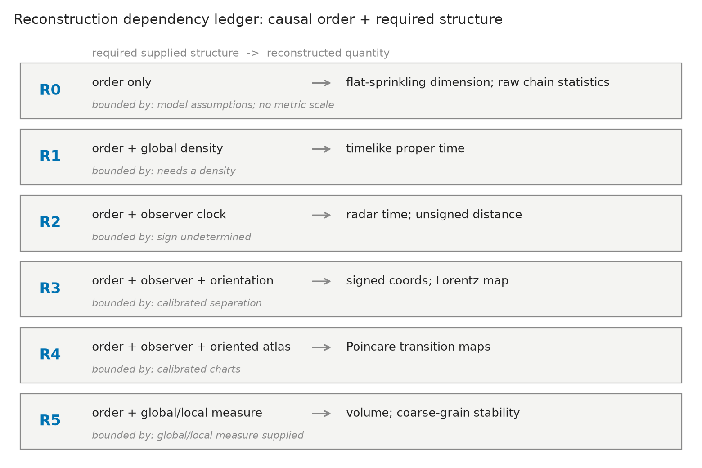
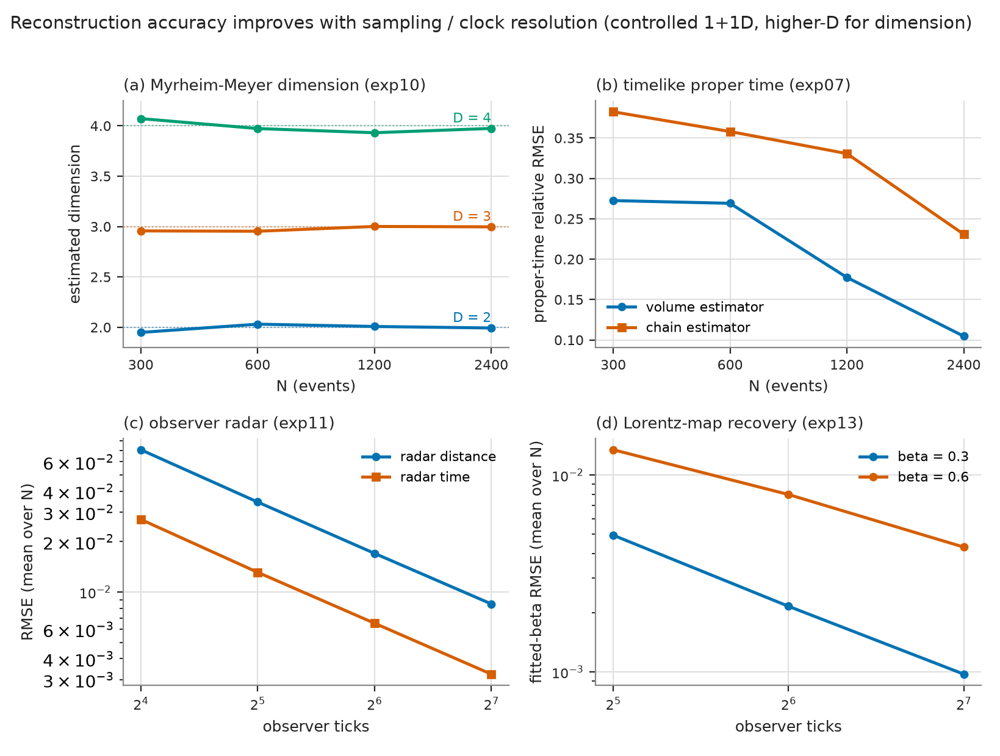
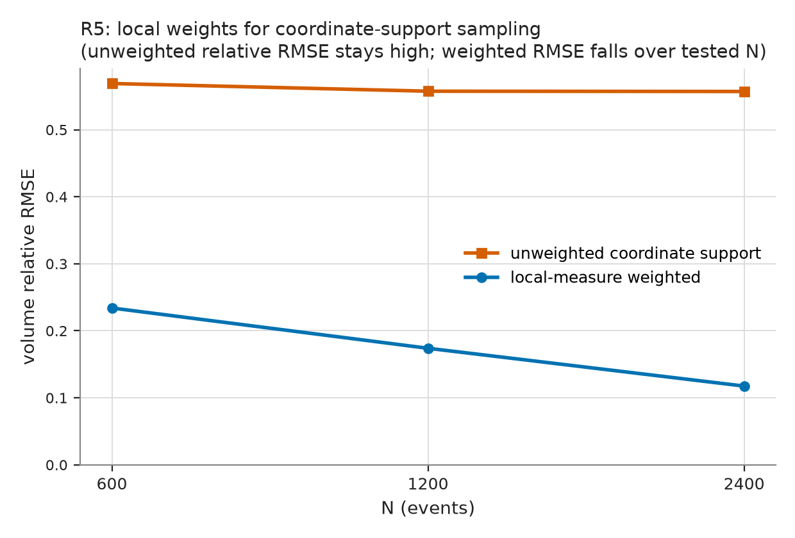
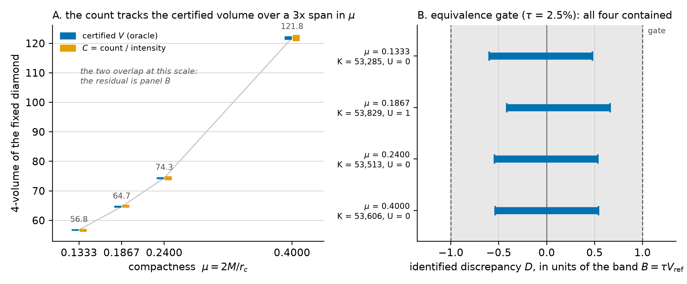

# An operational reconstruction ladder for spacetime quantities from causal order

**Juneyoung Kim**
Independent researcher · lpaiu.cs@gmail.com

**Draft v0.4.** Causal Spacetime Lab. Every quantitative result is tied to a
producing experiment and expected output path. The submission gate is met:
all 19 cited legacy summary tables are committed and digest-locked, and the
Section 6 capstone cites only committed, provenance-locked artifacts
(Section 10 and `artifact_manifest.md`). No number is from memory.

## Abstract

We study, in controlled 1+1D (and, for dimension, higher-D) Minkowski models,
which spacetime quantities can be operationally reconstructed from a causal
(accessibility) order once a minimal, explicitly declared set of additional
ingredients is supplied. We organize the reconstructions as a ladder. In flat
Poisson-sprinkled Alexandrov intervals, order statistics estimate dimension,
and raw longest-chain length is an uncalibrated timelike statistic; converting
it to proper time requires density and dimension-dependent normalization.
Adding a global event-density calibration turns Alexandrov interval cardinality
into a timelike proper-time estimate whose error is consistent with
finite-sampling noise at the tested settings. Adding an observer chain with clock
labels yields radar time and unsigned radar distance; adding an orientation
reference lifts the reflection degeneracy to signed coordinates and lets one
recover the Lorentz map between two inertial protocols; adding overlapping
charts yields an observer atlas with approximately consistent Poincare
transition maps; adding supplied measure information, implemented in exp19 as
local weights, makes volume reconstruction possible under the conformal
ambiguity, and density-rescaled reconstruction is stable in the tested
random-thinning protocol. We also give a Rindler horizon analogue, in which an
accelerated observer's two-way radar reconstruction is confined to the expected
wedge, and a finite-speed lattice counterexample showing that finite signal
speed alone does not produce Lorentzian structure. As a capstone we validate,
in a preregistered two-claim design on a 3+1D vacuum plane wave whose
coordinate volume form and sprinkling law are exactly flat, that the
conformal-class information order carries is detectable at finite density:
both the paired mean shift of the global relation fraction and a single-poset
classifier confirm against frozen margins. Separate preregistered stages
extend both claim classes to a frozen Schwarzschild exterior patch (type D,
whose coordinate volume element is likewise mass-independent): the C1 paired
effect is confirmed, while C2 single-poset discrimination is detected with
incomplete separation. A further preregistered stage anchors a measurement to
a certified prediction rather than to an operational margin: on each rung of a
mass ladder whose diamond is fixed in absolute coordinates so that no rung is
an isometric copy, the certified-membership count of a Poisson sprinkling is
required to realize that rung's independently certified continuum 4-volume
within a frozen 2.5% band, and does so at all four tested compactnesses —
spanning a factor of three in `2M/r`, the deepest rung anchored at `r = 4M`
between the photon sphere and the ISCO. The
contribution is not any
single reconstruction — most are standard — but the explicit accounting of what
each rung requires and the negative results that bound it. We make no claim
that spacetime is reducible to causal order; the reconstructions are controlled
validations inside known models.

## 1. Introduction

A conservative reading of the causal-set and order-first programs is that, for
future- and past-distinguishing Lorentzian spacetimes, causal or chronological
structure determines the conformal class. Supplying a volume element fixes the
remaining conformal factor, up to diffeomorphism and unit conventions
[@blms1987; @malament1977; @hkm1976; @kronheimer1967; @sorkin2005; @surya2019].
This paper treats that statement operationally and quantitatively. Rather than
ask whether spacetime "is" a causal set, we ask: fix a causal (or
null-accessibility) order in a known model; then, supplying an explicitly
declared ingredient set, which spacetime quantities can a finite procedure
actually reconstruct, with what error, and where does each reconstruction stop?

The value of posing it this way is an explicit *ledger*. Many individual
reconstructions here are standard — proper time from longest chains
[@brightwell1991], volume from interval cardinality [@blms1987], dimension from
ordering fractions [@myrheim1978; @meyer1988], radar coordinates from an
observer protocol. What is easy to lose, and what we make explicit, is exactly
which extra structure each requires and what remains underdetermined without it.
The ladder also isolates three instructive negative results: causal order alone
does not fix conformal scale; a single observer yields only unsigned distance
(a reflection degeneracy); and finite signal speed alone does not imply
Lorentzian structure.

Contributions: (1) a reconstruction ladder that indexes recoverable spacetime
quantities by the minimal supplied ingredient set, with per-rung error behavior in
controlled models; (2) grounded validations of dimension, proper time, radar
decomposition, Lorentz-map and atlas consistency, and measure-dependent volume;
(3) three bounding negative results (conformal scale, reflection degeneracy,
finite-speed lattice); (4) a Rindler reconstruction-inaccessibility
analogue; and (5) a preregistered 3+1D capstone validation that a pure-Weyl
deformation of the light cones — at identical coordinate volume form and
sprinkling law — measurably moves the causal order at finite density
(Section 6), together with its type-D (Schwarzschild) extension, where
separate preregistered stages confirm the paired claim and detect single-poset
discrimination (Section 6.7). All results are controlled validations, not
evidence that geometry reduces to order.

## 2. The reconstruction ladder

We separate the *primitive* from *supplied ingredients* and index rungs by the
minimal ingredient each requires.

Primitive:

- **Causal / accessibility order.** A strict partial order on events (in the
  continuum models, Minkowski causal precedence; null-inclusive).

Supplied ingredient symbols (these form branches, not one linear hierarchy):

- **M — global event-density calibration.** The conversion between event count
  and physical volume in the declared sampling model.
- **O — observer chain with clock labels.** A timelike chain carrying ordered
  tick labels (an operational clock), defining a radar protocol.
- **R — oriented synchronized reference.** A second beacon chain with calibrated
  separation, fixing a spatial side.
- **A — observer atlas.** Multiple overlapping observer charts.
- **W — local measure profile / weights.** The physical volume element relative
  to the support sampling measure.

Rungs (minimal ingredient -> what is reconstructed):

| Rung | Ingredient | Reconstructed | Bounded by |
| --- | --- | --- | --- |
| R0 | order only | flat-sprinkling dimension estimate; uncalibrated chain statistics | manifold/model assumptions; no metric scale |
| R1 | order + M | timelike proper time (interval cardinality -> volume -> tau) | needs a density |
| R2 | order + O | radar time; unsigned radar distance | sign undetermined |
| R3 | order + O + R | signed coordinates; Lorentz map between protocols | supplied orientation |
| R4 | order + O + R + A | atlas transition maps (Poincare); invariant agreement | oriented, calibrated charts |
| R5 | order + M + W | volume under conformal ambiguity; coarse-graining stability | global and local measure supplied |

Three negative results bound the ladder from below (Section 5): conformal scale
is not fixed by order alone (motivating M and W); a single observer gives only
unsigned distance (motivating R); and finite signal speed alone does not give
Lorentzian structure. Figure 1 summarizes the ladder.

*Figure 1. The reconstruction dependency ledger. Each row names a minimal
ingredient set and the quantity it unlocks; the observer and measure rows are
branches rather than one cumulative linear chain. The "bounded by" line records
what that ingredient set still does not supply.*

## 3. Methods (verified foundation layer)

Natural units, c = 1. The foundation modules were checked for numerical
correctness against known results (sprinkling measure, Minkowski causal
precedence, longest-chain and interval-cardinality normalizations,
Myrheim-Meyer inversion, radar/Lorentz/Rindler formulas); this section states
the conventions the results depend on.

- **Sprinkling.** Events are sampled uniformly with respect to the Minkowski
  volume in a causal diamond (rejection sampling on the ball-volume slice;
  equivalently uniform in null coordinates). The 1+1D and D-dimensional
  diamonds and the 1+1D forward cone are provided.
- **Causal order.** For events (t, x), i precedes j iff t_j - t_i > 0 and
  (t_j - t_i)^2 - |x_j - x_i|^2 >= -atol (null-inclusive J+; strict in time,
  so irreflexive).
- **Longest chain.** Topological-sort longest-path DP on the order; the 1+1D
  proper-time normalization uses the Brightwell-Gregory constant
  (L ~ sqrt(2 rho) tau, i.e. L ~ 2 sqrt(N) in a diamond of N events,
  consistent with Section 4.2 and Appendix A), with an
  endpoint-inclusive counting convention and acknowledged finite-size
  corrections.
- **Interval cardinality.** The open Alexandrov interval count K between two
  events estimates volume V = K/rho; in 1+1D V = tau^2/2, so tau_est =
  sqrt(2K/rho).
- **Myrheim-Meyer dimension.** The ordering fraction (related pairs over all
  pairs) is inverted against the known f(d) curve to estimate spacetime
  dimension in flat Alexandrov intervals.
- **Radar coordinates.** For a supplied observer chain, tau_minus and tau_plus
  are the latest preceding and earliest succeeding tick labels; radar time is
  their mean and radar distance their half-difference. A single chain gives
  unsigned distance; a second oriented chain supplies the sign. Lorentz maps
  between two inertial protocols are fit on their overlap [@perlick2008].
- **Rindler.** An accelerated (Rindler) observer in flat spacetime, with
  analytic two-way radar ticks; the reconstructible region is the Rindler
  wedge, with the horizon appearing as a reconstruction-inaccessibility
  boundary [@rindler1966].
- **Conformal / measure.** Positive conformal rescalings preserve causal order
  while changing volume and clock scale; volume reconstruction then requires
  supplied measure information (implemented in exp19 as local weights). In the
  tested random-thinning protocol, reconstruction is stable after density
  rescaling.

## 4. Results

Each result is a controlled validation in a known model; we report the grounded
number and its producing script.

### 4.1 R0 — order alone

**Dimension.** In the declared flat Poisson-sprinkling model, the
Myrheim-Meyer order statistic estimates spacetime dimension: for true
dimension 2 the estimate moves 1.95 -> 2.03 -> 2.01 -> 1.99 at N = 300, 600,
1200, 2400; for dimension 3, 2.96 -> 2.95 -> 3.00 -> 3.00; for dimension 4,
4.07 -> 3.97 -> 3.93 -> 3.97. Endpoint RMSE is lower at N = 2400 than at
N = 300, with non-monotonic finite-sample fluctuations for dimensions 3 and 4
(exp10; `outputs/data/dimension_reconstruction_summary.csv`).

**Uncalibrated timelike statistic (longest chain).** The longest chain follows the
Brightwell-Gregory scaling L ~ sqrt(2 rho) tau, approached from below at finite
density: at rho = 300 the normalized length L/(sqrt(rho) tau) is 1.325 with
endpoints included and 1.085 with endpoints removed, versus the asymptotic
sqrt(2) ~ 1.414, giving a finite-size low bias (mean chain proper-time error
-0.127) (exp09; `outputs/data/longest_chain_calibration_summary.csv`). The
approach toward the asymptotic value with N is shown by the chain estimator's
error falling with N in Section 4.2. Raw longest-chain length is
order-theoretic. Interpreting it as proper time, including the normalization
quoted here, belongs to R1 because it requires density and a dimension-specific
asymptotic law; absolute scale is not fixed by order alone.

### 4.2 R1 — order + measure: timelike proper time

With event density supplied, Alexandrov interval cardinality reconstructs
timelike proper time between internal pairs, tau_est = sqrt(2K/rho). The
volume-estimator relative RMSE falls from 0.273 at N = 300 to 0.105 at
N = 2400. Its separately aggregated RMSE is below the chain estimator's
(0.382 -> 0.231) at every N, but the volume statistic uses 500 pairs per N
whereas the chain statistic uses 125, so this is not a paired comparison
(exp07; `outputs/data/timelike_pair_reconstruction_summary.csv`). In a
fixed-interval sanity check, the interval-cardinality formula returns
tau = 2.0 exactly because the full sampling diamond uses K = N and rho = N/V;
this is a normalization identity, not an independent accuracy test. The chain
estimate converges toward it
(0.303 at N = 200 -> 0.0125 at N = 2000) (exp03;
`outputs/data/timelike_reconstruction_summary.csv`). The observed errors are
consistent with finite-sampling noise at the tested settings: the ratio of
reconstruction RMSE to the predicted Poisson standard deviation is 0.93-1.07
across N (binomial 1.00-1.14). Smaller bias or other estimator errors are not
excluded (exp08;
`outputs/data/probe_pair_statistical_calibration_summary.csv`).

### 4.3 R2 — order + observer: radar time and unsigned distance

Given an observer chain with clock labels, radar time and unsigned radar
distance are reconstructed from causal accessibility; at N = 300 the error
falls roughly by half per doubling of tick resolution — radar-time RMSE from
0.027 at 16 ticks to 0.0033 at 128 ticks, radar-distance RMSE from 0.072 to 0.0085, with
the accessible fraction 1.0 throughout (exp11;
`outputs/data/discrete_radar_reconstruction_summary.csv`). A single observer
determines only unsigned distance (the reflection degeneracy of Section 5).

### 4.4 R3 — + orientation: signed coordinates and the Lorentz map

A second synchronized beacon chain with known separation supplies orientation,
lifting the degeneracy to signed 1+1D coordinates. The affine map recovered
between two oriented inertial protocols approaches the Lorentz boost, with the
fitted-beta RMSE falling with tick density. Averaged over N as in Figure 2, it
falls from 0.00495 at 32 ticks to 0.000975 at 128 ticks for beta = 0.3, and
from 0.01345 to 0.00431 for beta = 0.6 (exp13;
`outputs/data/oriented_radar_lorentz_summary.csv`).

Figure 2 collects the convergence behavior of the first four rungs: dimension
recovery (a), timelike proper time (b), observer radar (c), and Lorentz-map
recovery (d).

*Figure 2. Reconstruction accuracy in controlled models. (a) Myrheim-Meyer
dimension estimates lie near D = 2, 3, 4; endpoint RMSE is lower at N = 2400
than N = 300 despite non-monotonic finite-sample fluctuations (exp10).
(b) Timelike proper-time relative RMSE falls with N, the interval-volume
estimator below the separately aggregated longest-chain estimator (exp07).
(c) Observer radar time and distance RMSE fall about by half per doubling of
clock ticks (exp11).
(d) Recovered Lorentz beta RMSE falls with clock ticks for two boosts (exp13).
Panels (c, d) are means over N; axes are logarithmic where noted.*

### 4.5 R4 — + oriented atlas: transition-map consistency

With overlapping observer charts that retain the synchronized, calibrated
orientation reference from R3, affine Lorentz/Poincare transition maps fit
on chart overlaps show approximately consistent composition and invariant
agreement, improving with tick density: the mean transition-map beta error
falls 0.0047 -> 0.0012 and the invariant-interval RMSE 0.050 -> 0.010 (ticks
32 -> 128), while loop closure (A -> B -> C versus direct A -> C) has a
beta-composition error of 0.0072 -> 0.0017 (exp14;
`outputs/data/observer_atlas_transition_summary.csv`,
`outputs/data/observer_atlas_loop_summary.csv`). On exact analytic input the same
transition/loop machinery recovers the maps to machine precision (beta error
~5.6e-17, RMSE ~4e-17) (exp15;
`outputs/data/exact_poincare_map_sanity.csv`).

### 4.6 R5 — + conformal measure: volume and coarse-graining

Positive conformal rescalings preserve causal order while changing volume and
clock scale: under constant (1.0/1.5/2.0) and sinusoidal rescalings the causal
matrix is unchanged and the reconstructed dimension is identical (2.020), while
the proper-time ratio tracks 1.0/1.5/2.0 and the volume ratio 1.0/2.25/4.0
(exp18; `outputs/data/conformal_order_ambiguity_summary.csv`). With supplied
measure weights, weighted volume reconstruction has negligible observed bias
and decreasing relative RMSE (0.234 -> 0.118 across the tested N), whereas,
for exp19's coordinate-volume support sampling, the unweighted estimate
retains a large low bias with no material RMSE improvement
(0.569 -> 0.557, bias ~ -0.29); the analytic
volume/proper-time formulas are verified to ~1e-7 (exp19, exp20;
`outputs/data/weighted_conformal_volume_summary.csv`,
`outputs/data/conformal_volume_exact_sanity.csv`). Under random thinning, density-rescaled
reconstruction is stable (volume RMSE 0.018 -> 0.009, dimension steady ~2.0)
while the uncorrected estimate blows up to RMSE 0.270 (bias -0.183) at 25%
retention (exp23; `outputs/data/thinning_coarse_graining_summary.csv`).
Figure 3 shows the measure dependence directly.

*Figure 3. R5: volume reconstruction requires supplied measure information. For
the coordinate-volume support sampling used in exp19, the weighted estimate
has negligible observed bias and decreasing RMSE over the tested N, while
omitting the supplied local weights gives the reported persistent bias
(constant-1.5 conformal profile). Equivalent measure
information can conceptually be encoded in the sampling law rather than as
post-hoc weights; that alternative is not part of Figure 3's evidence package.
Order alone fixes no absolute scale.*

### 4.7 Horizon analogue — Rindler reconstruction-inaccessibility

For an accelerated (Rindler) observer in flat spacetime, two-way radar
reconstruction is confined to the Rindler wedge. The ideal-wedge classification
is exact — precision = recall = 1.0, zero false positives and false negatives
in every configuration — with the wedge covering about a quarter of events
(accessible fraction ~0.25) and the in-wedge radar-time RMSE falling with tick
resolution (e.g. 0.0098 -> 0.0023) (exp16;
`outputs/data/rindler_horizon_reconstruction_summary.csv`). Comparing observers
directly, all events are accessible to the inertial observer while only ~0.25
(ideal wedge) / ~0.21 (finite clock coverage) are accessible to the Rindler
observer, and no event is Rindler-accessible but inertial-inaccessible — a
strict subset (exp17;
`outputs/data/inertial_vs_rindler_accessibility.csv`). This is a controlled
flat-spacetime horizon analogue, not a black-hole simulation.

## 5. Negative results that bound the ladder

- **Conformal scale is not fixed by order alone.** Positive conformal
  rescalings leave the causal order invariant while changing physical volume
  and clock scale (Section 4.6). Absolute scale therefore requires a supplied
  measure (rung M); R0 therefore supplies uncalibrated order statistics, not a
  proper-time scale.
- **A single observer gives only unsigned distance.** One chain's radar
  distance is |x|: two targets at x = +0.1 and x = -0.1 return the identical
  single-observer distance 0.1, while the two-chain oriented protocol recovers
  the signed positions +0.1 and -0.1. Signed coordinates therefore require an
  orientation reference (rung R) (exp12;
  `outputs/data/single_observer_reflection_degeneracy.csv`).
- **Finite signal speed alone does not give Lorentzian structure.** After
  calibrating density at the final time, a regular finite-speed lattice shares
  the continuum model's leading quadratic count growth, while finite-t counts
  differ (t = 5: 21 vs 14.75; t = 30: 496 vs 496). Yet its edges lie only along the
  two lightcone diagonals (465 each), so it has a discrete symmetry, not the
  continuous Lorentz symmetry of a sprinkled causal set (exp05;
  `outputs/data/finite_speed_lattice_growth.csv`). Finite speed is necessary
  but not sufficient; statistical Lorentz compatibility is the additional
  structure.

An exploratory spacelike-distance proxy (common-past / common-future /
enclosing-interval counts) is reported as boundary-dependent and *not* a
validated spacelike estimator: the counts vary strongly with the sampling
region rather than tracking spacelike distance cleanly (exp06;
`outputs/data/spacelike_distance_proxy_summary.csv`).

## 6. Capstone validation: finite-density detectability of the conformal class

The ladder reconstructs quantities from supplied ingredients inside flat
models; Section 5 bounds it from below. This section caps it from the other
side, with the converse of the first negative result. Section 4.6 showed that
*within* a conformal class, order carries no scale: positive rescalings leave
the causal matrix unchanged. By the theorems that motivate the program, order
determines the conformal class itself — so *across* conformal classes order
must differ. Whether that difference survives finite density, for a curvature
channel that touches nothing but the order, is the question this capstone
answers affirmatively, as a preregistered experiment (P14 in the program's
internal numbering; within this program, the first finite-density crossing of
the conformal-flatness ceiling, via a 4D type N pure-Weyl construction).

### 6.1 The 1+1D conformal ceiling

Every 1+1D metric is conformally flat, so in the 1+1D stages of this program
(and its curvature-focused companions P12-P13) curvature could reach the order
only through the volume-coefficient channel: those experiments tested
curvature entering through the measure/counting channel, and the channel in
which order directly carries a conformal-class difference could not be tested
there at all. This was an intended dimensional limit of the models, not a
confounded experiment: Weyl curvature — the conformal-class content of
curvature — is identically zero below four spacetime dimensions, so a direct
test needs a 4D construction built so that the measure channel is exactly
frozen while the conformal class moves.

### 6.2 Pure-Weyl control construction

The construction is a vacuum plane wave in Brinkmann coordinates with profile
`A(u)(x^2 - y^2)` on a constant-`A` slab: Ricci-flat, Petrov type N, with
`det g = -1` identically. Because `det g = -1`, the coordinate volume form and
the Poisson sprinkling law are *identical* to flat spacetime. That identity
supports the strongest form of pairing, and *C1 uses it*: C1's control
reading is the *same sprinkled point set* read with `A = 0`, so for C1 any
difference between the two readings is a functional of the relation change
alone — it cannot be a sampling artifact, an intensity mismatch, or a
calibration residual. C2 deliberately does *not* pair: its two arms are
independent, unpaired sprinkling streams drawn under the identical sprinkling
law, with finite-sample variation controlled by its frozen interval rules
rather than removed by pairing — because its claim is about telling one
ensemble's posets from the other's, not about a within-point-set
counterfactual (Section 6.3). What is *not* identical between geometries is
the causal-diamond volume: the light-cone boundary
tilts, and at equal proper time the curved-arm diamond volume sits 0.4%
(`wT = 1`) to 7.3% (`wT = 2`) above flat — a deterministic design check pins
both numbers. "Same measure" here means the volume form and sprinkling law
only, never interval volumes; conflating the two was the first design draft's
central error, caught in review, and the distinction is load-bearing.

### 6.3 Finite-density detection design

An exploratory probe chain (four probes and a confirmation stage, run on
seed streams disjoint from everything that follows) selected the operating
point — slab `(1.0, 1.0, 2.0, 6.0)`, `w = 1.0`, expected 300 events per
sprinkling — and the primary statistic, the global relation fraction (the one
candidate computable from a single poset alone). The preregistered stage then
froze two claims with deliberately different boundaries, never merged into
one sentence:

- **C1 (paired ensemble mean).** The estimand is
  `theta_Delta = E[f_A - f_0]`, the ensemble mean of the *net* change of the
  relation fraction over paired readings of the same points — not any single
  point set's displacement, and not the gained-plus-lost total motion.
  Confirmation requires the 95% Student-t interval of the mean paired
  difference (n = 3000 sprinklings) to sit entirely above a frozen margin
  `epsilon_Delta = 3.579e-4`, an operational margin anchored to the probe
  chain's confirmed block.
- **C2 (single-poset classifier, independent replication).** A frozen
  classifier reading only the single-poset relation fraction must separate
  curved from flat ensembles (n = 4800 per unpaired arm) under three frozen
  interval rules (standardized separation, AUC with an exact boundary bound
  at complete separation, balanced accuracy), each with its own equivalence
  band. This claim replicates the probe chain's confirmation stage on fresh
  seeds; its failure would have been reported as a conflicting replication,
  never a retroactive cancellation.

The stage verdict POSITIVE requires both claims confirmed, certified as a
joint event before execution (4000/4000 joint-effect replicates; the null
branches certify each claim's equivalence power separately at an exact
Clopper-Pearson 95% lower bound of at least 0.90; a joint equivalence verdict
is deliberately not defined, because its joint null rate sits below that
floor at the frozen sizes).

### 6.4 Preregistered result

The campaign ran once, from a clean checkout of the freeze commit, on frozen
seeds, and recorded the executing commit in the artifact. Both claims
confirmed; the stage is POSITIVE.

| Claim | Verdict | Result (95% CI) |
| --- | --- | --- |
| C1 paired ensemble mean, n = 3000 | confirmed | mean 0.0502929 [0.0501046, 0.0504812]; lower end 140x the margin 3.579e-4 |
| C2 classifier replication, n = 4800/arm | confirmed | separation s = 11.199 [11.035, 11.362]; AUC = 1.0 [0.999232, 1.0]; balanced accuracy = 1.0 [0.986, 1.014] |

The two arms' relation-fraction samples are completely separated (the minimum
curved-arm value exceeds the maximum flat-arm value in 4800 draws per arm);
the AUC interval at complete separation is the frozen exact bound, not the
degenerate Wald interval. Every relation census in both claims recorded zero
ambiguous and zero escalated pairs. The frozen sentences are recorded in
Korean in the artifact and are quoted here verbatim (unwrapped, so the byte
sequence matches the artifact), each followed by an explicit, non-frozen
English translation:
C1 "paired ensemble 평균 이동이 ε_Δ를 넘는다"
(*the paired ensemble mean shift exceeds epsilon_Delta*);
C2 "P3-C 분리를 독립적으로 재현했다."
(*the probe chain's separation is independently reproduced*)
(`docs/prereg/p14_prereg_results.json`).

### 6.5 What this establishes

At a fixed box, density, and profile, an order-only statistic separates flat
from curved ensembles: the conformal-class information that order carries by
theorem is *detectable at finite density*, in the one construction where the
sprinkling measure is exactly frozen. Together with Section 4.6 this closes
the conformal story in both directions — within a class, order is blind to
scale; across classes, at least at this operating point, order visibly moves.

### 6.6 What the plane-wave result alone does not establish

It is not a general-Weyl discriminator (the plane wave is Petrov type N and
its exact volume form is unrepresentative); it is not Weyl-tensor recovery
(detection and recovery are different claims; no reconstructed quantity is
produced, which is why this is a capstone boundary experiment and not a new
ladder rung); it does not establish box- or density-independence (the licensed
sentence is bound to the frozen operating point); and, by itself, it does not
open the Schwarzschild generalization. Both claim classes are carried there by
the separate preregistered extensions of Section 6.7 — the C1 paired claim
confirmed, C2 single-poset discrimination detected with incomplete
separation; the diamond-volume oracle is now certified, and its direct-MC
instrument audit is complete as an auxiliary result (Section 9, Appendix B),
and the prediction-anchored Poisson-count stage is executed across a
four-rung mass ladder, CONCORDANT at every rung (Section 6.8). A
separate cost measurement (S1) prices the causal-predicate component — about
0.77 ms per pair on the tested solver, patch, and tolerance, roughly 360x the
plane-wave predicate (`docs/prereg/p14_s1_cost.json`).

### 6.7 Type-D extension: preregistered C1-paired confirmation and C2-unpaired detection in Schwarzschild

The paired half of the capstone design transfers to the Schwarzschild
exterior on a measure identity: in Schwarzschild coordinates the volume
element is `sqrt(-g) = r^2 sin(theta)` — independent of the mass and equal to
the flat spherical element — so one sprinkle of a coordinate patch serves
both geometries, exactly as `det g = -1` served the plane wave. What the
identity controls is the sampling measure; individual diamond volumes differ
under the two causal structures, and that difference is part of the signal
(the Section 6.2 distinction, unchanged). The frozen patch is the S1 solver
domain (`M = 1`, exterior shell `r` in `[10, 20]`, polar cap, coordinate-time
extent 40), with `N ~ Poisson(300)` events per reading and the S1 predicate
at tolerance 1e-8 with escalation to 1e-10.

An exploration stage (S3, seed-ledger disciplined, preserved with its raw
per-reading arrays) measured the paired shift and sized a preregistered
confirmation (S4). The frozen rule
(`docs/prereg/p14_s4_schwarzschild_c1.md`) fixes two gates evaluated on
identified intervals with strict comparisons: a primary detection gate
(identified CI95 above the frozen threshold `eps_det = 0.0036`, about 10% of
the exploration anchor, in the frozen negative direction) and a secondary
replication gate (the independent two-sample Welch CI95 of the S4-S3
difference inside `+-eps_rep = +-0.0012`, one exploration reading-SD); a
verified inclusion makes the joint verdict numerically equivalent to the
replication gate at these margins. Branch powers were certified before the
freeze by resampling both blocks from a conservatively scaled empirical
distribution (20000/20000 on every branch, exact Clopper-Pearson 95% lower
bound 0.9998), with a constructed negative-control battery proving each gate
can fail. The campaign ran once, from the exact freeze checkout, with an
8-file content-addressed manifest verified at entry and at exit.

| Gate | Frozen condition | Result | Verdict |
| --- | --- | --- | --- |
| A: C1 detection (primary) | identified CI95 top < -0.0036 | CI95 [-0.036211, -0.035953] | pass (10x margin) |
| B: replication (secondary) | Welch CI95 of S4-S3 inside +-0.0012 | [-0.000183, +0.000194] | REPLICATED |

Stage verdict: CONFIRMED. The census recorded zero ambiguous pairs and one
escalated pair, resolved at the tighter tolerance. The frozen sentences are
recorded in Korean in the artifact (`docs/prereg/p14_s4_results.json`) and
quoted verbatim (unwrapped, so the byte sequence matches the artifact), each
followed by a non-frozen English translation:
"동결된 Schwarzschild 좌표·도메인(M=1, r∈[10,20], 극관각 캡 1.0, T=40)의 공통 측도 위에서, paired 앙상블 평균 이동의 identified CI95가 동결 방향으로 검출문턱 ε_det = 0.0036을 초과했다 — 유한밀도 인과 census가 type D 진공 곡률의 빛원뿔 변형을 C1-급으로 검출했다(프로그램 내부 진술)."
(*on the frozen Schwarzschild coordinates and domain, the paired ensemble
mean shift exceeds the frozen detection threshold in the frozen direction — a
finite-density causal census detects the light-cone deformation of type-D
vacuum curvature at C1 grade; a program-internal statement*);
"S4 블록과 S3 탐색 블록의 독립 두-표본 차이의 identified Welch CI95가 ±ε_rep = ±0.0012 안에 들어, 탐색 효과가 정량적으로 재현됐다."
(*the independent two-sample difference between the S4 and S3 blocks lies
inside the replication band: the exploration effect is quantitatively
reproduced*).

A second, separate preregistered stage (S5) carries the single-poset claim
class. Guided by a committed stored-data feasibility audit
(`docs/prereg/p14_c2_feasibility_audit.json`, exploratory, zero additional
solver calls, conservatively anchored), its rule
(`docs/prereg/p14_s5_schwarzschild_c2.md`) declares — before sizing and
independently of the confirmation data — AUC 0.60 as the minimum practically
useful single-poset discrimination. Two INDEPENDENT arms (fresh Schwarzschild
and fresh flat sprinkles; 300 readings each by a pre-declared minimum-n rule
with directly certified branch powers) score each reading by its global
relation fraction; the primary gate is an unclipped DeLong AUC CI95 with a
four-way outcome (detected / equivalent-at-margin / direction-reversed /
inconclusive, strict comparisons, identified-agreement across the curved
bound series), and a secondary out-of-sample balanced-accuracy gate uses a
deterministic Clopper-Pearson-Bonferroni interval with a train-half-only
threshold. The campaign ran once from its own exact freeze checkout:

| Gate | Frozen condition | Result | Verdict |
| --- | --- | --- | --- |
| Primary: AUC (DeLong) | CI95 lower > 0.60 | AUC 0.9734, CI95 [0.9630, 0.9837] | **DETECTED** |
| Secondary: out-of-sample BA | joint CI95 lower > 0.60 | BA 0.9033, CI95 [0.8356, 0.9500] | pass |

Zero ambiguous and zero escalated pairs; both identified bound series agree.
The frozen sentences are recorded in Korean in the artifact
(`docs/prereg/p14_s5_results.json`) and quoted verbatim (unwrapped), each
followed by a non-frozen English translation:
"동결된 Schwarzschild 도메인·밀도에서, 단일 causal set의 global relation fraction은 flat/Schwarzschild 앙상블을 우연 수준보다 판별하는 정보를 운반한다 (AUC CI95 하한 > 0.60, 프로그램 내부 진술)."
(*on the frozen Schwarzschild domain and density, the global relation
fraction of a single causal set carries information that discriminates flat
from Schwarzschild ensembles above chance — AUC CI95 lower bound above 0.60;
a program-internal statement*);
"out-of-sample balanced accuracy의 결합 95% 하한이 0.60을 넘어, 학습-외 판별이 확인됐다 (secondary)."
(*the joint 95% lower bound of out-of-sample balanced accuracy exceeds 0.60:
out-of-training discrimination holds; a secondary verdict*).

What this extends, and at what grade: on the same frozen Schwarzschild domain,
the two claim classes of the plane-wave capstone are now each supported by a
SEPARATE preregistered stage — the C1 paired claim CONFIRMED (S4), C2
single-poset discrimination DETECTED (S5). There was no joint primary
verdict, and the grades differ from the plane wave: its C2 separation was
complete, while the Schwarzschild discrimination is strong but imperfect
(AUC ≈ 0.973; no completeness gate was preregistered); the secondary BA
verdict neither strengthens nor combines with the primary. The extension
establishes no mass-generality (a single frozen `M`) and uses no
diamond-volume oracle (margins operationally anchored or independently
declared) — the mass ladder and the certified-volume anchor belong to the
separate stage of Section 6.8, which does not promote these two verdicts.
Execution provenance for both stages, including the
executed-freeze manifest snapshots, is in Appendix B.

The full execution provenance — the preregistration's freeze ordering, its
mechanical gates, and the commit-ancestry contract — is in Appendix B.

### 6.8 Prediction-anchored Poisson count, and its mass generalization

Every verdict so far is anchored operationally: a margin taken from an
exploration block, or a threshold declared before sizing. This stage is
different. The diamond-volume oracle certifies an interval for the continuum
4-volume `V` of a fixed causal diamond, by directed-rounding arithmetic and
before any count data exists; a Poisson sprinkling then supplies a count of
elements certified to lie inside that same diamond. The question is whether
the operational instrument realizes the certified prediction. Nothing in
Sections 6-6.7 is used to answer it, and the answer cannot be tuned after the
fact: the endpoints, the intensity, the tolerance and the decision rule are
all frozen in the rung's preregistration before its seed is drawn.

**The instrument.** Points are sprinkled at a frozen intensity `A` into the
certified box, and each point's membership is decided by the certified causal
predicate on both legs. A point the predicate cannot decide at the frozen
tolerance is *not guessed*: it is counted as ambiguous (`U_amb`) and enters
the decision only through the conservative end of the interval. Each rung
first runs a fixed-`n` ambiguity pilot (exact Clopper-Pearson plus an exact
Poisson tail bound at `alpha = 0.01`, tail budget `1e-3`) that must certify
`U_max <= 30` before the count campaign is sized; the campaign's membership
test short-circuits on a decided first leg, so a point the campaign calls
ambiguous is necessarily one the pilot's test would also call ambiguous, and
the pilot's bound transfers a fortiori.

**The frozen rule.** From the realized `(K_certain, U_amb)` the rule builds a
deliberately conservative *outer* count interval — the exact Garwood lower
limit at `K_certain`, the upper limit at `K_certain + U_amb`, each tail at
level 0.025, so the ambiguous points can only widen the interval outward and
never move it toward agreement. Rescaled by the intensity this is a volume
interval `C = [L/A, U/A]`, and the quantity gated is the *identified
discrepancy* against the certified enclosure,

    D = [C_lo - V_hi, C_hi - V_lo],   required to lie in [-B, +B],
    B = tau * V_ref,   tau = 2.5%,

with three ways out and no fourth: contained gives CONCORDANT, disjoint
gives DISCORDANT, and anything else gives INCONCLUSIVE, published as it
falls. The arithmetic is 96-bit end to end, and contract tests prove at the
integer boundaries that the frozen acceptance window is exactly the set of
counts the decision function calls CONCORDANT, so "the sizing" and "the
verdict" cannot drift apart.

**The ladder.** One rung would establish the gate at one geometry. To ask
whether the agreement is a property of the instrument rather than of a lucky
configuration, the same gate is carried across a preregistered mass ladder.
The certified shell `[10, 20]` and the anchors `(12, 18)` stay fixed in
*absolute* coordinates and only the mass changes, so no rung is an isometric
copy of another: the pre-frozen dimensionless indicator is the compactness
`mu = 2M/r_c` at the anchor midpoint `r_c = 15`, and the executed ladder
spans a factor of three in it. The deep end is not a free choice either:
every mass-generic lemma certifies exactly on `M` in [0.92, 3.33] — bounded
above by the photon sphere `3M` reaching the shell floor at `M = 10/3` —
and the deepest rung `M = 3.0` keeps a certified margin of a tenth of the
shell floor on that binding condition, its inner anchor at `r = 4M` between
the photon sphere and the ISCO. The patch-level lemmas are
mass-generic only under stated conditions (horizon below the shell, `K < 0`,
`w` monotone, `Q > 0`, the L2a patch bound, four L4 margins, an L5 winding
cross-check), and each is re-certified per rung as an interval comparison —
nothing is inherited silently from `M = 1`.

Four rungs were executed, each from its own exact freeze checkout, with its
own seed, once:

| `mu` | `M` | certified `V` | pilot | `N` | `K_certain` | `U_amb` | `C` | `D` | `B` | verdict |
|---|---|---|---|---|---|---|---|---|---|---|
| 0.1333 | 1.0 | [56.492959, 57.060667] | k=0 | 26,831,117 | 53,285 | 0 | [56.205871, 57.169553] | [-0.854796, +0.676594] | 1.419420 | **CONCORDANT** |
| 0.1867 | 1.4 | [64.336198, 64.982744] | k=1 | 15,057,284 | 53,829 | 1 | [64.307488, 65.405648] | [-0.675256, +1.069450] | 1.616487 | **CONCORDANT** |
| 0.2400 | 1.8 | [73.968637, 74.711920] | k=0 | 9,847,124 | 53,513 | 0 | [73.695211, 74.956037] | [-1.016709, +0.987400] | 1.858507 | **CONCORDANT** |
| 0.4000 | 3.0 | [121.225021, 122.443280] | k=0 | 4,605,671 | 53,606 | 0 | [120.802632, 122.867592] | [-1.640649, +1.642571] | 3.045854 | **CONCORDANT** |

**Figure 4.** The executed ladder. *Left:* at each preregistered
compactness, the certified continuum volume (blue) and the volume implied by
the sprinkled count (orange). The two overlap at plot scale across a
threefold span in `mu` -- that overlap is the result. *Right:* the residual
made visible, each rung's identified discrepancy `D` divided by that rung's
own band `B = tau*V_ref`, so the four are comparable despite different
bands; the shaded region is the gate. Every rung is contained, with roughly
half the band to spare, and the `mu = 0.1867` rung's asymmetry is its single
ambiguous point widening the interval outward as the rule provides. Both
panels are generated from the same artifacts the contract tests re-derive
(`figures/make_ladder_figure.py`); no value is typed in.

The certified volume grows monotonically with the compactness (57 to 65 to
74 to 122) as the geometry requires, and the realized discrepancy stays well inside
the band at every rung. The `M = 1.4` pilot returned the program's first
non-zero ambiguous count (`k = 1`); it was absorbed exactly as the sizing
had provisioned, and it is visible in that rung's asymmetric `D`, which is
the conservative widening working as designed rather than a defect.

**What this establishes.** On each preregistered rung independently, an
operational finite-density instrument realized that rung's independently
certified continuum volume to within `tau = 2.5%`, under a rule fixed before
the data existed. This is the first place in the program where a measurement
is confronted with a certified *prediction* rather than with an operational
anchor, and the confrontation is repeated at four genuinely different
curvatures rather than one — the deepest with its inner anchor between the
photon sphere and the ISCO.

**What it does not establish.** The rungs are separate preregistered stages:
each verdict stands alone, there is no joint primary verdict, and no
interpolation, extrapolation, or composite cross-rung statistic is claimed —
in particular nothing is claimed at compactness between or beyond the four
tested values. Agreement of a count with a volume is not a test of causal-set
theory, and it is not evidence that spacetime is discrete; it is a statement
that this instrument, at these operating points, reproduces the continuum
measure it was pointed at. It upgrades neither the C1/C2 verdicts of Sections
6-6.7 nor the auxiliary O4b instrument audit, none of which use it. And the
result is bounded by its construction exactly as the capstone is: one fixed
diamond, one fixed density per rung, a Schwarzschild exterior shell, and a
tolerance chosen to be feasible rather than to be sharp.

## 7. Discussion

The ladder is a branched accounting device, not a single cumulative chain.
Across its dependency rows it recovers a substantial fraction of operational
Lorentzian geometry — dimension, timelike duration, radar decomposition,
Lorentz and Poincare consistency, volume — from a causal order plus short,
explicit ingredient sets. It is equally a list of what each reconstruction
*costs*: absolute scale costs a
measure; a signed spatial coordinate costs an orientation; a metric-not-merely-
conformal statement costs a volume element; Lorentzian structure is not bought
by finite speed alone. Stating both directions together is the point: it turns
"causal structure fixes the conformal class, and a volume element fixes the
remaining conformal factor" from a slogan into a per-quantity operational
ledger with measured error behavior.

This framing also clarifies what the program does *not* show and sets up the
open question. Everything here is reconstruction inside known models: the
geometry is put in (by sprinkling from Minkowski or by a supplied protocol) and
recovered. It does not address whether geometry could *emerge* from an order
that was not built from a geometry — the representability question — which
requires a validated discriminator and is taken up separately. The Section 6
capstone sharpens the boundary from the other side: the one piece of geometry
that order itself carries — the conformal class — is not merely present by
theorem but detectable at finite density, exactly where the measure channel is
frozen and only the light cones move.

## 8. Claim boundary

We claim, as controlled validations in known 1+1D (and higher-D for dimension)
models: dimension is estimated from order statistics in flat sprinklings;
timelike proper time is
recoverable from interval cardinality once a density is supplied, with
finite-sampling-consistent error; radar time and unsigned distance are
recoverable from an observer protocol, signed coordinates and the Lorentz map
with an orientation reference, and atlas transition maps with overlapping
oriented, calibrated charts; volume is recoverable with supplied global
density and local measure information and is stable
under density-rescaled coarse-graining; and a Rindler wedge is the
reconstructible region for an accelerated observer. As the preregistered
capstone (Section 6), at the frozen 3+1D operating point: the paired ensemble
mean of the relation-fraction change under a pure-Weyl deformation exceeds its
frozen margin (C1), and a frozen single-poset classifier separates curved from
flat ensembles, independently replicating the probe chain's confirmation (C2).

We do not claim: that spacetime is reducible to, or emerges from, causal order;
that causal order alone yields absolute scale, the conformal factor, signed
coordinates, or a unique atlas; that finite signal speed implies relativity; or
that any of these finite validations establish a physical theory. Reconstructing
a geometry that was put into the model is not deriving geometry from order.
For the capstone we additionally do not claim: a general-Weyl discriminator,
Weyl-tensor recovery, or box- or density-independence of the separation. The
Schwarzschild path carries its own preregistered verdicts (Section 6.7: C1
confirmed and C2 detected with incomplete separation, in separate stages with
no joint primary verdict) and its own non-claims; the diamond-volume oracle
is certified and instrument-audited there as an auxiliary result (Section 9),
but no Section 6.7 verdict uses it. We claim, as a separate preregistered
stage per rung (Section 6.8): on each of the four preregistered rungs
`mu` in {0.1333, 0.1867, 0.2400, 0.4000} independently, the
certified-membership
count of a Poisson sprinkling realized that rung's independently certified
continuum volume within `tau = 2.5%`, under a rule frozen before the data
existed (CONCORDANT at every rung). For that Poisson-count stage we do not
claim: any joint or composite cross-rung verdict, any statement at
compactness between or beyond the tested rungs (no interpolation, no
extrapolation), any promotion of the Section 6-6.7 verdicts or of the
auxiliary O4b audit, and nothing about causal-set theory or the
discreteness of spacetime — a count agreeing with a volume says the
instrument reproduces the measure it was pointed at, at one fixed diamond
and one fixed density per rung. A literature priority search (August 2026)
found
partial overlap in four areas: causal-order-and-number/volume
reconstruction (Braun 2025 \cite{braun2025}; Myrheim 1978
\cite{myrheim1978}), Schwarzschild sprinkle count verification
(Homšak–Veroni \cite{homsakveroni2024} §V.1), analytic diamond-volume
comparison theorems (Berthiere–Gibbons–Solodukhin
\cite{berthiere2016}), and Schwarzschild causal-relation algorithms
(He–Rideout \cite{herideout2009}). The directed-rounding volume
enclosure and the preregistered TOST gate against it have no direct
prior; the parallel Alfyorov–Shnyukov CJ estimator
\cite{alfyorov2026weyl} measures Weyl curvature from Hasse diagrams
and is orthogonal. The equivalence gate applies established
methodology — a confidence-interval form of the two one-sided tests
procedure \cite{schuirmann1987,lakens2017} on exact Poisson (Garwood)
\cite{garwood1936} and binomial (Clopper–Pearson) \cite{clopperpearson1934}
intervals, and equivalence-testing-based model validation
\cite{robinsonfroese2004} — with the frozen rule requiring the identified
discrepancy, against the certified enclosure, of a conservative outer
Garwood count interval (its lower limit from the certain count, its upper
limit from the count including its ambiguous members, rescaled to a volume)
to fall within the band (each Garwood tail at level 0.025, more conservative
than the conventional 0.05). Its statistical novelty is thus the
preregistered application against a certified enclosure, not the apparatus.

## 9. Limitations and future work

Results are controlled and mostly 1+1D (dimension is checked to 4D, and the
Section 6 capstone is 3+1D). The
constants are convention-dependent (chain endpoint convention, null-inclusive
causal relation, Myrheim-Meyer normalization); we state each where it is used.
The spacelike proxy is exploratory. The capstone is bounded by its
construction: Petrov type N with an exactly flat volume form — the property
that makes the experiment clean also makes it unrepresentative of generic
`Weyl != 0` spacetimes — and by its single frozen operating point;
generalizing beyond type N is now partially opened rather than closed: the
Schwarzschild C1-paired extension is confirmed and the single-poset (C2-class)
Schwarzschild stage is preregistered and detected with incomplete separation
(Section 6.7), and the diamond-volume oracle is now fully certified — the
static-spacetime reductions derived in the public note
(`docs/theory/schwarzschild_volume_oracle_note.md`) were completed by an
MPFR directed-rounding flight-time certification, a uniform anchor-diamond
containment proof, and a certified cell-refinement integrator, and the frozen
configuration's volume was computed once from an exact freeze checkout:
`V ∈ [56.212737, 57.348019]`, relative half-width 0.009997 ≤ 0.01,
`target-met` (`docs/prereg/p14_o3_volume.json`).

An auxiliary instrument audit (O4b) then consumed that certified volume: at
the single frozen Schwarzschild configuration, the sampler, the S1 volume
response, and the certified oracle were found CONCORDANT under a frozen
composite error budget of 3.25% with simultaneous coverage ≥ 95% — G1
volume interval `[56.448806185841875, 56.9822829864225]` against the
certified `[56.212737, 57.348019]` (identified discrepancy
`[-0.8992123405928396, 0.7695461186219887]`, band `1.7034113309135284`),
G2 leak upper bound `0.14195058753928652` within budget
`0.14195094424279403` with zero leaking points. The audit's campaign run
completed both gates and stopped at a publication-wiring defect; the verdict
was recovered by re-applying the frozen decision functions to the preserved
sufficient statistics (`run_kind: recovered_completed_campaign` in
`docs/prereg/p14_o4b_results.json` — no new seed, no solver call, no
resampling, no gate change), with the recovery authenticated and
bit-exactness enforced by contract tests (Appendix B). This audit upgrades
nothing in Sections 6-6.7: it is a statement that the instrument stack
agrees with the certified continuum volume at one frozen configuration — not
a Poisson causal-set count verification, not mass- or domain-generality, not
a C1/C2 joint verdict, and not complete separation or general volume
accuracy. The prediction-anchored Poisson-count stage (sprinkle counts
against `rho V`) is a separate stage, and it has since been executed across
the four-rung mass ladder of Section 6.8 — CONCORDANT at
`mu` in {0.1333, 0.1867, 0.2400, 0.4000} — which is what carries the
prediction-anchored claim; the O4b audit itself remains only the instrument
statement described above. That ladder has its own bounds: four rungs are
four points, the tolerance was chosen to be feasible rather than sharp, and
the certification window itself closes at `M = 10/3`, where the photon
sphere reaches the shell floor — the executed ladder stops one tenth of the
shell floor short of that cliff, by certification rather than by taste. The natural next question — whether
observer-relative distance *order* can be validated as recovering latent
geometry, as opposed to being reconstructed from a supplied one — is the
subject of a companion study that builds a preregistered discriminator on this
foundation, measures its dose-response to geometry dilution and its dimension
selection in 2+1D, and then carries it to orders produced by growth dynamics
and by an action-weighted 2D-order ensemble. At N = 600, random-start
post-burn-in configurations at beta = 2 and beta = 8 pass the frozen
instrument, while the beta = 32 bipartite-start control blocks structurally.
These are not certified equilibrium draws, and the companion study did not
establish an equilibrium transition or finite-size scaling.

## 10. Reproducibility

Foundation-layer baseline commit `325df55`. Every number in Sections 4-5 has a
cited `experiments/exp*.py` producer and expected summary path. All 19 cited
summary tables are committed under `figures/data/`, regenerated in one
recorded environment (CPython 3.11.9, numpy 2.4.6, matplotlib 3.11.1) from
the unmodified baseline producers; `artifact_manifest.md` records the
regeneration, per-file row counts, and raw SHA-256 digests under the
repository's LF storage-boundary rule, and a contract test recomputes every
digest. The submission gate — the 19 legacy tables plus
the finalized Section 6 evidence bundle, provenance-locked — is met.
Conventions
(sprinkling measure, causal relation, chain and interval normalizations,
Myrheim-Meyer inversion) are fixed in the foundation modules and stated in
Section 3.

Section 6 carries no regeneration debt: every number it cites lives in a
committed artifact, and the repository's test suite recomputes the capstone's
metrics, verdicts, and sentences from the stored raw samples, reproduces a
prefix of every frozen seed stream, and asserts the commit-ancestry contract
of Appendix B. The stage runner (`experiments/positive_control/p14_prereg.py`)
exposes three modes — `preflight`, `manifest`, `campaign` — and the campaign
mode refuses to run unless the freeze manifest exists, its recorded preflight
digest matches the committed artifact, and the certified source digests match
the checked-out files.

Section 6.7 inherits the same standard for both of its stages: each runner
(`experiments/positive_control/s4_schwarzschild_c1.py`,
`experiments/positive_control/s5_schwarzschild_c2.py`) refuses to run unless
an 8-file content-addressed freeze manifest matches the checked-out protocol
surface byte-for-byte, verified at entry and re-verified at exit, behind a
fail-closed CLI; contract tests recompute the CONFIRMED (S4) and DETECTED
(S5) verdicts — including the DeLong interval, the balanced-accuracy
threshold and Clopper-Pearson-Bonferroni interval, and the frozen sentences —
from the stored per-reading arrays through the frozen gate functions; and the
seed ledger separates fresh allocation from deterministic replay, with replay
output owned by a separate path that can never replace a fresh-observation
artifact.

The auxiliary O4b instrument audit (Section 9) meets the same standard with
one addition. Its campaign runner refuses to run except on the clean exact
checkout of the approved freeze SHA against a 25-file content-addressed
manifest with an environment lock; the executed surface is preserved
byte-for-byte as `docs/prereg/p14_o4b_executed_freeze_manifest.json`. Because
the run stopped at a publication-wiring defect after both gates completed,
the published verdict is a *recovery*: `experiments/oracle/o4b_recover.py`
re-applies the frozen decision functions (empirical-Bernstein interval,
Clopper-Pearson bound, frozen sizing constants) to the preserved sufficient
statistics, authenticates its inputs against the SHA-256 of the committed
incident and checkpoint records with a two-file cross-check, and refuses to
publish unless the recomputation reproduces the preserved verdict
bit-for-bit; contract tests (`tests/test_o4b_recover.py`) pin the
recomputation, the tamper refusals, and the published artifact, and
regression tests (`tests/test_o4b_wiring_fixes.py`) drive the repaired
`main()` path end to end. No new seed was drawn, no solver called, no point
resampled, and no gate changed anywhere in the recovery.

## Appendix A: conventions and normalizations

| Quantity | Convention used |
| --- | --- |
| Causal relation | null-inclusive J+: i precedes j iff t_j - t_i > 0 and (dt)^2 - (dx)^2 >= -atol, atol = 1e-12; strict in time (irreflexive) |
| Longest chain | endpoint-inclusive count; 1+1D normalization L ~ sqrt(2 rho) tau (asymptotic normalized value sqrt(2) ~ 1.414), finite-size corrected |
| Interval volume (1+1D) | open Alexandrov count K; V = K/rho; V = tau^2/2, so tau_est = sqrt(2K/rho) |
| Myrheim-Meyer | ordering fraction r = (related ordered pairs)/(N(N-1)) inverted against f(d) = Gamma(d+1)Gamma(d/2)/(4 Gamma(3d/2)); equals the standard unordered form up to a factor 2 on both sides |
| Radar coordinates | tau_minus = latest preceding tick, tau_plus = earliest succeeding tick; radar time = (tau_plus + tau_minus)/2, radar distance = (tau_plus - tau_minus)/2 |
| Density (finite-N) | fixed-N sprinkle with empirical density; Poisson and fixed-N binomial sampling models both reported |

These are stated so the reported constants (e.g. the sqrt(2) chain
normalization, the interval-volume factor) are unambiguous; each is fixed in
the foundation modules.

## Appendix B: capstone execution provenance

The Section 6 result is reproducible not merely in the sense that its code is
committed, but in the sense that the *order of operations* — freeze before
execution, execution before recording — is provable from the repository's
commit graph and enforced by mechanical gates.

**Commit chain.** Design and probe chain: PR #38-#48. Preregistration:
preparation commit (PR #49), S1 cost measurement (PR #50), then
`P' = 51875a2` (a one-source seed-ledger fix) -> preflight executed on a clean
checkout of `P'`, its artifact recording `code_version = P'` and the SHA-256
digests of every execution-relevant source file -> final-freeze commit
`F = b858b08` carrying the certification artifact and the freeze manifest
(preflight digest, `preflight_code_version = P'`, the S1 price sentence, the
frozen sizes and seeds; PR #51) -> the campaign executed on a checkout of
exactly `F` (not a descendant merge commit, so the recorded executing HEAD is
`F` itself) -> results commit `R = 5126ddf`, a direct child of `F` (PR #52).
A test asserts `P' ≺ F ≺ R` with `git merge-base --is-ancestor`.

**Gates.** Stochastic modes refuse a dirty worktree at entry. The campaign
mode refuses to run unless (i) the freeze manifest exists, (ii) its recorded
preflight digest matches the committed preflight artifact, and (iii) the
source digests certified at preflight entry match the checked-out files —
captured at entry and re-checked at exit, so a mid-run edit aborts the run
with nothing recorded. Interrupted runs restart the same seed; an ambiguity
violation blocks the stage rather than permitting a seed swap.

**Artifacts.** The complete Section 6 evidence bundle, with digests, is
enumerated in `artifact_manifest.md`; the per-sentence mapping from manuscript
text to evidence file is recorded there as the citation-to-artifact inventory.

**Section 6.7 (Schwarzschild extension) provenance.** Freeze commit
`ceed85d` (PR #57, merge `5cffd90`) carries the frozen rule, the fresh seed
registration, the runner, the contract tests, and the 8-file
content-addressed freeze manifest — and no results. The campaign executed
once on a clean checkout of exactly `ceed85d`; the runner captured the git
state at entry, refused a dirty tree, verified every manifest digest at entry,
and re-verified both at exit before writing, so the artifact's recorded
lineage is `start == end == ceed85d`, clean, `run_kind = fresh_observation`.
The results commit (PR #58, merge `492e61f`) added the artifact, moved the
campaign seed from fresh to observed in the ledger, and flipped the runner's
campaign path to a deterministic replay whose output is owned by a separate
file and can never replace the fresh observation. Because that flip
legitimately changed two protocol-surface files, the CURRENT tree's manifest
hashes the post-result replay surface; the manifest that governed the
executed run is preserved byte-for-byte as
`docs/prereg/p14_s4_executed_freeze_manifest.json`, and a contract test
verifies that snapshot against the historical blobs at `ceed85d` directly.
Interrupted runs restart the same seed; undecided pairs are absorbed by
identified intervals rather than a stop rule.

**Section 6.7 second stage (S5) provenance.** Freeze commit `1c26224`
(PR #60, merge `3aeb8e5`) carried the rule, the fresh seed registrations, the
runner, and the power certification; an execution review then caught an
exact-versus-approximate chi-square mismatch in the certified resampling
source, and the corrected freeze is `86e3674` (PR #61, merge `f286508`) —
certification unchanged under the exact factor. The campaign executed once on
a clean checkout of exactly `86e3674` (entry == exit git state, the 8-file
content-addressed manifest verified at both ends, fail-closed CLI,
`run_kind = fresh_observation`, curved seed 40000251 / flat seed 40000261).
The results commit (PR #62, merge `d1e0d20`) added the artifact, moved both
seeds to observed, flipped the campaign path to a replay whose output is
owned by a separate file, and preserved the manifest that governed the
executed run byte-for-byte as
`docs/prereg/p14_s5_executed_freeze_manifest.json`, verified against the
historical blobs at `86e3674` by a contract test; the CURRENT
`p14_s5_freeze_manifest.json` hashes the post-result replay surface.

**Auxiliary O4b instrument-audit provenance (oracle arc).** The certified
oracle chain is O1 -> O2 -> O3 (PR #64-#68): flight-time certification,
certified cell integrator, then the O3 freeze (`785148e`) and its one
approved execution producing the certified volume
(`docs/prereg/p14_o3_volume.json`, executed surface
`p14_o3_executed_freeze_manifest.json`). The first audit stage, O4, aborted
at its G3 with no verdict (PR #69-#70); its replay diagnostic and G3
redesign reopened the preregistration (PR #71-#74), and O4b was frozen with
new seeds (PR #75). The approved execution SHA is the freeze branch head
`715865a` — not the merge commit. The campaign executed once from that clean
exact checkout: G3a passed (71 wrapper-contract cases, 6,537 metered calls),
`refs/o4b/reservation` was claimed (`46acee34`, retained permanently,
spending seeds 40000401/40000411), G1 ran to 26,200,000 points and G2 to
1,072,696 points, and the run stopped at the pre-publication provenance
re-read on a wiring defect — the claim callback returned `None` — publishing
nothing. The preservation commit (PR #76, merge `83e366c`) committed the
incident and checkpoint verbatim (`p14_o4b_incident.json`,
`p14_o4b_checkpoint.json`), retired both seeds in the ledger, and snapshotted
the executed surface byte-for-byte
(`p14_o4b_executed_freeze_manifest.json`, byte-identical to the freeze blob
at `715865a`). The recovery commit (PR #77, merge `50586dd`) published
`p14_o4b_results.json` with `run_kind = recovered_completed_campaign` by
re-applying the frozen decision functions to the preserved statistics —
bit-identical to the preserved verdicts, inputs authenticated by blob
SHA-256 pins and an incident/checkpoint cross-check, the remote reservation
re-verified immediately before publication; per the frozen stage-verdict
table (G1 and G2 both concordant, G3a valid, frozen `n` reached) the stage
verdict is CONCORDANT. The maintenance commit (PR #78, merge `a04e860`)
fixed the wiring defects — the claim return value, the budget stage label,
an explicit incident `failure_point`, a named checkpoint RNG stream — with
end-to-end regression tests over the real `main()` path, leaving the result,
incident, checkpoint, and executed snapshot untouched. No campaign rerun and
no same-seed re-entry occurred anywhere in this chain; the historical
no-verdict records of the O4 abort and the O4b incident retain their
original verdicts, with the recovery linked rather than retroactively
regraded.

## Acknowledgements and disclosure

This work was carried out with substantial assistance from AI language
models (Anthropic Claude), used for literature search, code and manuscript
drafting, numerical analysis, and adversarial review of the author's own
claims. The AI systems are not authors and bear no responsibility: the
author takes full responsibility for every claim, number, and citation
here.

How the output was verified, and how far that verification reaches. Every
quantitative result in Sections 4-6.8 is produced by a committed experiment
script whose output file is pinned by a content-addressed manifest that a
contract test recomputes, so the *artifacts* cannot drift unnoticed. The
manuscript's own transcription of those artifacts is machine-checked in two
places: Section 6.8's per-rung figures are re-derived from the published
artifacts, and the auxiliary audit's figures are pinned verbatim, so a
hand-typed value in either fails the build. Elsewhere the link is weaker
and is stated as such, by two distinct routes. The legacy results of
Sections 4-5 name their producing experiment (`exp03`-`exp23`) and its
committed summary table, audited in `producer_audit.md`. The preregistered
results of Sections 6-6.7 instead name their own frozen artifacts --
`p14_prereg_results.json` for the capstone, `p14_s4_results.json` and
`p14_s5_results.json` for the Schwarzschild extensions -- each with its
executed freeze manifest; the auxiliary audit's `p14_o4b_results.json`
belongs to this route too, but its printed figures are the verbatim-pinned
exception named above. Both routes are digest-locked at the artifact, and
outside those two machine-checked exceptions the manuscript's transcription
is not re-derived by a contract; it was checked by reading. The preregistered stages ran
once each from an exact clean checkout of a merged freeze commit, under
frozen decision rules, with their verdicts computed by the frozen code
rather than asserted in prose. Every bibliographic entry was checked
against an authoritative record (arXiv, Crossref, or the publisher) and
then re-checked independently; the priority assessments in the companion
records name the sources that were fetched.

## References

Verified bibliography in `citations/references.bib` (shared verified core with
Paper B), including the radar-method and uniformly accelerated-frame sources
used here.
