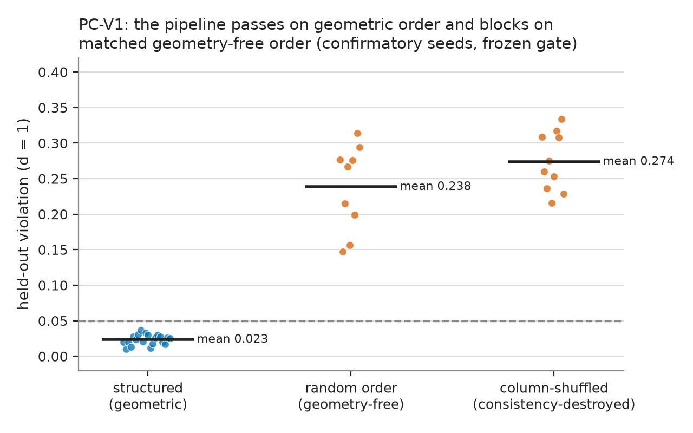
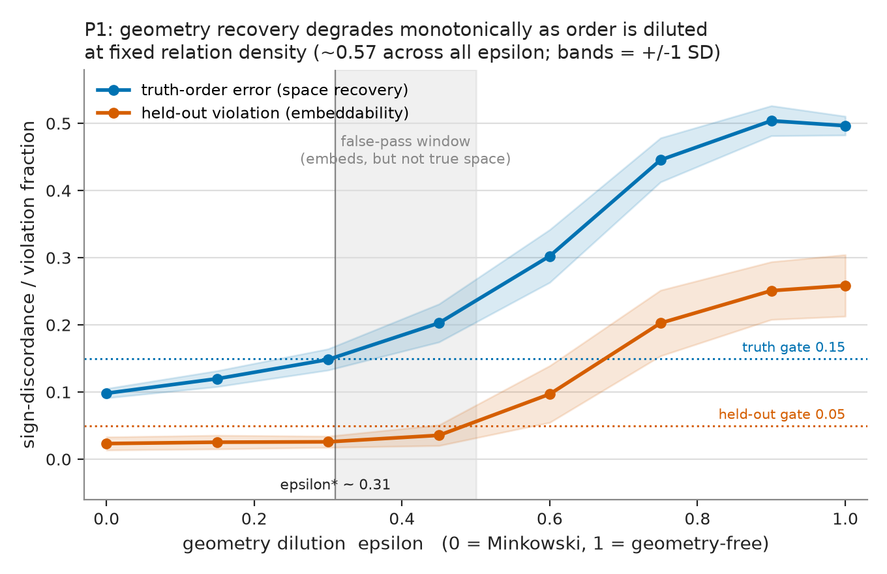
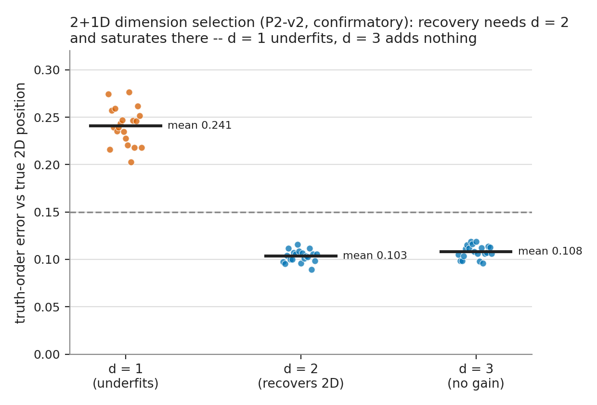
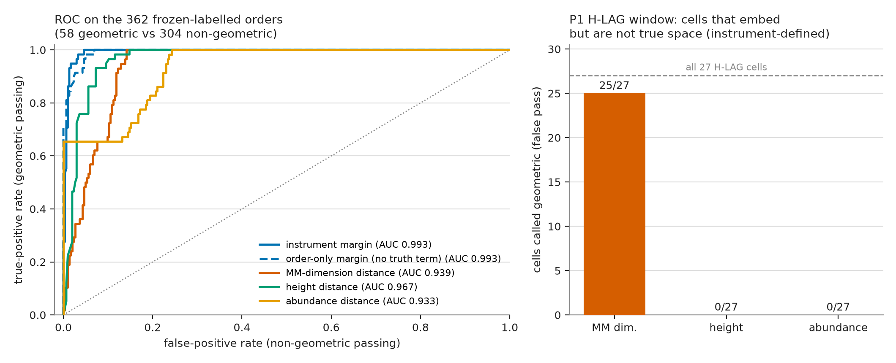
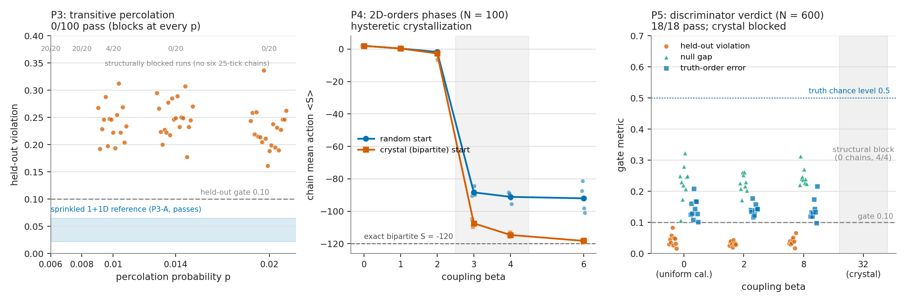
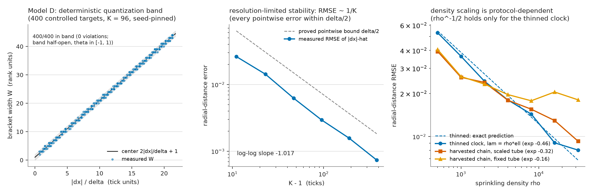
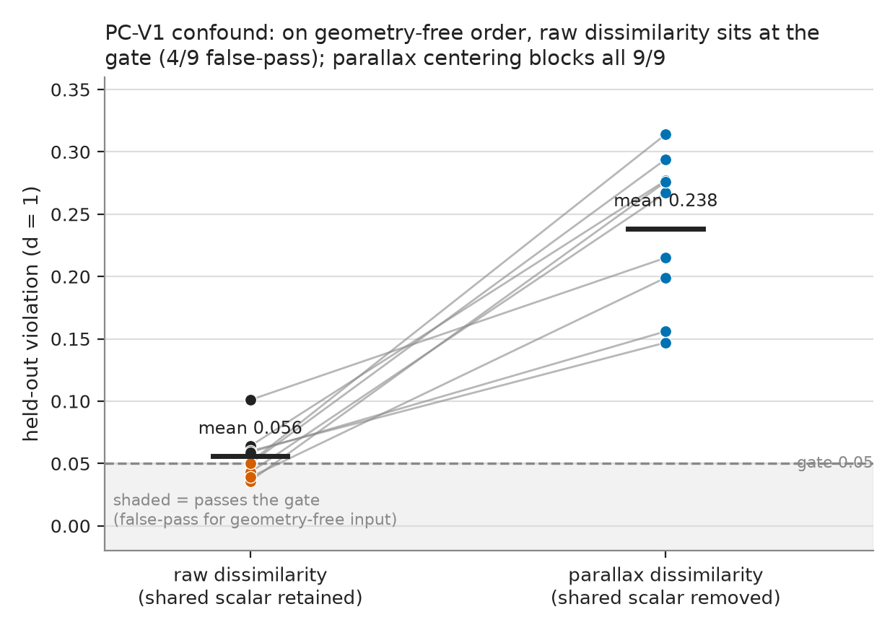

# A validated discriminator for latent geometry in discrete causal order: dilution response and survival in an action-weighted ensemble

**Draft v0.6.** Causal Spacetime Lab. All preregistered empirical results
trace to frozen artifacts (`docs/prereg/frozen/`); the Section 8 theory
results are analysis-only and trace to committed, CI-pinned theory
artifacts (`docs/theory/`, no frozen artifact touched); see Section 12.

## Abstract

Causal-set and order-first programs ask when metric geometry can be treated as
an effective representation of a discrete causal order. A recurring difficulty
is methodological: a procedure that fits low-dimensional coordinates to
order-derived comparisons can appear to "recover geometry" even when none is
present — embeddability is not recovery. We build a preregistered pipeline
that measures bracket-width response profiles along observer reference chains,
centers them into a parallax dissimilarity, and gates on stable
low-dimensional ordinal embedding, held-out prediction, and a shuffle null. We
first validate it as a *discriminator* — on the stated generator families and
scales, the sense used throughout: on 1+1D Minkowski-sprinkled causal sets it
passes 20/20 confirmatory seeds and recovers true spatial order, while
density-matched geometry-free and consistency-destroyed controls block on
every seed. Making geometry the manipulated variable at fixed relation
density, recovery degrades monotonically (Spearman rho >= 0.85 on 20/20
seeds), with a graded transition near epsilon ~ 0.31 and a robust "false-pass"
window in which profiles still embed while no longer encoding
true space; in 2+1D the pipeline recovers true 2D position and selects the
correct embedding dimension. We then carry the frozen instrument to ensembles
nobody tuned. Transitive percolation blocks on 100/100 preregistered runs.
Weighting unrestricted orders by the verified 2D Benincasa-Dowker smeared
action meets an exact crystalline obstruction — the complete bipartite order
has action eps N (2 - eps N), far below sprinkled values — and exploratory
sampling found no geometric window. In the entropically restricted 2D-orders
ensemble, however, the action-weighted measure has a continuum phase with a
hysteretic crystallization transition, and post-burn-in samples of that phase
pass the full discriminator (18/18 across beta = 2 and 8, recovering true
lightcone position at truth-order error ~ 0.14 against 0.5 chance) while the
crystal control blocks structurally (4/4). Constructed chain-rich layered
negatives close the remaining control gap — eight preregistered cells all
block at the geometry gates themselves (149/160 fresh seeds) — and a
preregistered head-to-head on identical data gives the instrument the
highest ROC AUC (0.993, against 0.967/0.939/0.933 for height,
Myrheim-Meyer dimension, and interval abundance; unchanged at 0.993
when the margin's truth term is removed so the comparison is
order-only), with the dimension
estimator false-passing 25/27 of the dilution false-pass window while
height, an excellent cheap screen here, remains slightly more monotone
than the instrument on the dilution sweep. An identifiability theory for
the profile observable closes the loop: we prove that the parallax
dissimilarity determines target order up to global reversal — and, by
explicit counterexample, nothing metric — with matching resolution and
concentration laws for the instrument's deterministic clock and its
Poisson idealization, pin every proved statement as a CI regression
(deterministic-clock claims verified against the instrument itself,
Poisson-idealization claims by direct seeded simulation of the stated
model), and show that the presumed
inverse-root density law for the error is protocol-dependent: it holds
for density-thinned clocks and fails to transfer to chains harvested
from the sprinkling, whose rate couples at the discreteness scale.
Embeddability alone is an unsafe
indicator of geometry; on this family, reconstructable geometry is not
explained by global relation density and survives action weighting exactly
where entropy is restricted and the coupling stays below crystallization. We
make no claim of continuum spacetime emergence: all statements are
finite-scale, instrument-relative, and bounded in Section 10.

## 1. Introduction

The hypothesis motivating this work is that operational time and distance can
be reconstructed from primitive causal or null information-accessibility
relations, with metric scale requiring additional structure such as event
density or observer protocols, rather than from velocity as displacement over
time. Within causal-set theory this is a familiar stance: causal order plus a
counting measure fixes a great deal of Lorentzian geometry in suitable
continuum limits [@blms1987; @sorkin2005; @surya2019]. A weaker, finite, and more
operational question is whether *observer-relative distance order*, derived
from causal accessibility and an observer protocol, admits a stable
low-dimensional metric representation, and under what conditions.

This question is easy to ask and easy to answer badly. Any procedure that fits
coordinates to minimize violations of order constraints will return *some*
low-dimensional configuration. Low fit error ("embeddability") does not
establish that the fitted coordinates track true spatial structure: a
dominant, geometry-free common mode in the input can be perfectly embeddable
while carrying no spatial information. A program that reads embeddability as
evidence of geometry can therefore accumulate results that are internally
consistent but uninterpretable, because it has never established that its
instrument distinguishes geometry from its absence.

We take the discriminator seriously as the primary object. Before asking
whether any causal order "has geometry," we ask whether our measurement-and-fit
pipeline can be shown to (i) pass on data with known latent geometry and (ii)
block on matched data without it. Only a pipeline that does both is a valid
instrument, and only then are its verdicts on ambiguous inputs meaningful. This
is the content of experiment PC-V1 (Section 4). We then use the validated
instrument to measure a dose-response: how recovery changes as geometric
consistency is titrated away at fixed density (experiment P1, Section 5).

Our contributions are: (1) a preregistered, provenance-tracked pipeline from
causal order to a representability verdict, with an instrument-integrity
protocol that fixes the fit budget and forbids a saturating stability metric;
(2) a positive/negative control (PC-V1) demonstrating sensitivity and
specificity, including two confounds that had to be removed before freezing;
(3) a geometry-dilution dose-response (P1) showing monotone degradation, an
identifiable transition, and a false-pass window; (4) the methodological
consequence that embeddability alone over-reports geometry, so a
truth-recovery check is load-bearing; and (5) an emergence chain (Section 7)
that carries the validated instrument to orders no longer built by hand — a
preregistered null on a geometry-free growth dynamics, an exact obstruction
to action weighting on unrestricted orders, a preregistered phase structure
for the action-weighted restricted ensemble, and the instrument-level
verdict that its continuum phase supports genuine order-intrinsic geometry
reconstruction while its crystal phase does not — hardened by chain-rich
hard negatives that block at the geometry gates rather than at chain
extraction, and by a preregistered same-data comparison against standard
manifoldlikeness diagnostics; and (6) an identifiability
and stability theory for the profile observable (Section 8) — order up to
reversal is exactly what the parallax dissimilarity carries (spacing
recovery is provably impossible from it), with a deterministic resolution
law for the instrument's clock, concentration bounds for its Poisson
idealization, and a protocol-dependence result for density scaling — every
proved statement pinned in CI, Model-D claims against the instrument
itself and Model-P claims by direct simulation of the stated model.

## 2. Related work and positioning

Causal-set theory reconstructs timelike distance from longest chains and
volume from interval cardinality [@blms1987; @brightwell1991], and dimension
from ordering fractions [@myrheim1978; @meyer1988]. Order-theoretic results
fix conformal structure from causal order in the continuum
[@malament1977; @hkm1976; @kronheimer1967]. Ordinal-embedding methods from
machine learning fit low-dimensional coordinates to quadruplet ("is d(i,j) <
d(k,l)") comparisons [@shepard1962; @kruskal1964; @kleindessner2014;
@agarwal2007]. Our pipeline sits at the intersection: it derives quadruplet
comparisons operationally from causal accessibility and observer protocols,
then applies ordinal embedding, but treats the fitted coordinates as a
representation diagnostic rather than as physical coordinates. The novel
methodological emphasis is the explicit discriminator validation and the
geometry-dilution dose-response, neither of which, to our knowledge, is
standard in order-first reconstruction studies.

Order-intrinsic probes of manifoldlikeness exist in the causal-set
literature and are the natural comparators for our instrument: interval-
abundance profiles as a locality/manifoldlikeness diagnostic [@glaser2013],
stable homology of thickened antichains [@major2009], spacelike-distance
constructions [@rideout2009], and the dimension estimators already cited
[@myrheim1978; @meyer1988]. These diagnostics ask "does this order look
manifoldlike?" observable-by-observable. Our discriminator differs in three
ways: it is validated end-to-end against matched positive and negative
controls before use (sensitivity and specificity, with frozen gates); it
requires truth recovery, not only a favorable statistic, wherever ground
truth exists; and it is preregistered, so its verdicts on new ensembles
(Section 7) are decided by rules fixed in advance. Sections 7.2 and 7.6
show why this matters in practice: a bipartite crystal defeats the
Myrheim-Meyer estimator but not the discriminator, and the preregistered
same-data comparison quantifies it — the dimension estimator false-passes
25/27 of the dilution false-pass window, exactly the regime where a
diagnostic is most needed. On the theory side, recent work proves
a quantitative embedding-uniqueness (Hauptvermutung-type) result for causal
sets admitting well-conditioned embeddings [@madsen2026]; this is
complementary — it says recovered geometry is essentially unique when it
exists in the high-density limit, while our instrument decides, at finite
scale, whether it exists. Section 8 supplies the finite-scale
identifiability counterpart for our own observable: what the profile
dissimilarity determines (spatial order, up to reversal), what it
provably does not (spacings), and at what resolution and confidence.

For the emergence chain (Section 7) the relevant background is dynamical and
statistical: classical sequential growth and its simplest member, transitive
percolation [@rideout2000]; the entropic dominance of non-manifoldlike
Kleitman-Rothschild-type orders [@kleitman1975]; the Benincasa-Dowker
causal-set action and its smeared, nonlocal family [@benincasa2010;
@dowker2013]; and Markov-chain studies of 2D causal set quantum gravity on
the restricted ensemble of 2D orders [@winkler1985; @surya2012], which
established a continuum/crystalline phase structure characterized by
macroscopic observables, with finite-size scaling of the transition studied
in [@glaser2018]. Our contribution there is not the phase structure —
which we independently reproduce under preregistration — but the judgment of
its phases by a validated reconstruction instrument, and the exact bipartite
obstruction explaining why the ensemble restriction is load-bearing.

Inline citations use pandoc-style keys (`@blms1987`, ...) matching the
verified `references.bib`; see `citations/citation_verification_report.md` for
the source confirming each entry.

## 3. Methods

All quantities are in natural units with c = 1. The pipeline reuses a
foundation layer (sprinkling, causal order, discrete radar, ordinal embedding)
whose numerical correctness against known causal-set results was verified
independently; this paper's contributions are the profile measurement, the
discriminator protocol, and the dilution experiment built on that layer.

### 3.1 Scenes: causal sets with observer chains

A scene is an N-event sprinkle in a 1+1D Minkowski causal diamond
(N = 900, diamond duration T = 2.0) plus K = 6 supplied stationary observer
"reference chains" at fixed spatial positions x0 in {-0.25, ..., 0.25}, each
carrying 96 tick events. The causal order is the standard 1+1D Minkowski
precedence relation (null-inclusive). Targets are bulk events in a thin band
(|t| <= 0.10, |x| <= 0.25) that are two-sided bracketed by all six chains, so
that missing-data effects are separated from representability; a scene must
yield >= 30 such targets (subsampled to at most 40). Every scene records
content hashes of its event array and causal matrix for provenance.

### 3.2 Bracket-width echo profiles and parallax dissimilarity

For target j and reference chain r, using tick indices as clocks, let p be the
last tick index that causally precedes j and s the first tick index that j
precedes on chain r. The bracket width W[j, r] = s - p is an order-level
"echo" observable; in the continuum it scales as 2|x_j - x0_r|/dtau. Clock
values are never used, only tick order.

Bracket widths carry a shared per-target component (a global/temporal common
mode present in any time-respecting order) that is not spatial. We therefore
center each target's widths across the chains that reach it,
P[j, r] = W[j, r] - mean_r W[j, r], keeping only the cross-observer *parallax*.
This operationalizes a simple principle: a single scalar shared across
observers is not a distance structure; only cross-observer disagreement is.
The profile dissimilarity is the RMS parallax difference over common reachable
chains, D[i, j] = RMS_r (P[i, r] - P[j, r]). Section 8 proves exactly what
this observable can and cannot identify: spatial order up to global
reversal is decodable from D alone, and spacings provably are not.

### 3.3 Representability gates

From D we sample quadruplet constraints "D(i,j) + delta < D(k,l)" with the
margin delta derived from the measured dissimilarity resolution (25th
percentile of positive gaps), split at the *pair* level (no target pair
contributes to both train and held-out, avoiding leakage), and fit a
low-dimensional ordinal embedding by hinge-loss gradient descent at dimensions
{1, 2, 3}. A scene is scored at dimension d = 1 (the spatial dimension of the
model) by four quantities: held-out constraint violation; the separation
between held-out violation on the real profiles and on a destructive,
marginal-preserving column-shuffle null ("null gap"); restart stability
measured as sign-discordance of pair distances across independent restarts;
and, where the true coordinates are known, the truth-order error (sign
discordance between fitted and true pair distances).

### 3.4 Instrument-integrity protocol

Two failure modes are precluded by construction. First, the fit budget is
fixed (>= 1500 steps, 5 restarts) and the runner asserts the executed budget
equals the requested one; an under-converged structured fit is otherwise
indistinguishable from a null fit. Second, a positional argsort-mismatch
stability metric (which saturates near one for dense continuous distances under
any restart jitter) is forbidden; sign discordance is used instead. Both
choices follow from a prior program in which a silently reduced budget and a
saturating metric made every verdict uninterpretable.

### 3.5 Preregistration

Each experiment is preregistered with fixed hypotheses, an exploratory
calibration stage that proposes thresholds by a mechanical rule, and a
confirmatory stage on disjoint fresh seeds under frozen thresholds. The
PC-V1 rule, stated in the preregistration before calibration ran, is:
held-out gate = min(0.35, p90 of the structured calibration distribution
rounded up to 0.05); null-gap gate = max(0.10, p10 rounded down to 0.05);
stability gate = min(0.30, p90 rounded up); truth gate = p90 rounded up.
Later experiments use the analogous midpoint or percentile rules recorded in
their preregistrations (e.g., P2-v2 places gates by the midpoint rule
between the d = 2 pass cluster and the d = 1 fail cluster). Instrument
repairs are permitted only before the freeze and are logged. Thresholds are
never retuned after the freeze; under-covered or scene-invalid cells are
recorded, never silently dropped. Frozen thresholds and decision registries
live in version control (`docs/prereg/frozen/`), not in the (gitignored)
outputs tree, so no decision input is ephemeral.

## 4. Experiment PC-V1: the pipeline is a discriminator

**Design.** Calibration on seeds 0-9 (exploratory) proposes gate thresholds;
confirmatory sensitivity on seeds 100-119 and specificity on seeds 200-209
apply the frozen thresholds. Sensitivity uses geometric scenes (H-SENS: they
should pass and recover x). Specificity uses two geometry-free control
families (H-SPEC: they should block): a density-matched random time-respecting
order, and a column-shuffle of the real profiles that preserves marginals but
destroys cross-observer consistency. Throughout, "geometry-free" is
operational shorthand for these spatial-geometry-destroyed nulls: they remain
time-respecting partial orders (global temporal structure and observer
chains are intact); what is removed is latent spatial geometry.

**Two confounds fixed before freezing.** The first calibration passed, but its
specificity controls exposed two instrument defects. (i) A geometry-free order,
once made density-comparable, still passed the embeddability gate: its profiles
were dominated by a shared per-target scalar (mean cross-chain column
correlation ~0.7 versus ~0.0 for geometric scenes) that embeds in one
dimension without encoding space (fitted 1D coordinate correlated with true x
at ~0.1-0.5 versus ~0.98 for geometric scenes). Centering to parallax profiles
(Section 3.2) removes it. (ii) The random control matched pre-closure edge
density but percolated under transitive closure to a near-complete order
(density ~0.997), an unfair degenerate foil; we instead match the geometric
post-closure density by bisection. Both are logged as pre-freeze repairs; the
frozen thresholds derive only from the post-repair calibration.

The first confound is quantified in Figure 7 (Section 9): under raw
dissimilarity the geometry-free control sits at the gate (mean held-out 0.056;
4 of 9 seeds fall below 0.05 and would false-pass), whereas parallax centering
lifts every seed decisively into blocking (mean 0.238).

**Frozen thresholds** (gate dimension d = 1): held-out violation <= 0.05, null
gap >= 0.15, restart stability <= 0.15, truth-order error <= 0.15. These were
set mechanically from the calibration distributions; both hard floors passed
(median structured held-out 0.025 <= 0.35; effect size between structured and
the destructive null, Cohen's d = 7.2).

**Results.** On calibration (d = 1), the two arms are cleanly separated with no
overlap:

| condition | role | held-out (min-max) | mean |
| --- | --- | --- | --- |
| structured (geometric) | should pass | 0.014-0.032 | 0.023 |
| relabel-symmetry (control) | should mirror structured | 0.012-0.047 | 0.023 |
| column-shuffled | should block | 0.210-0.376 | 0.277 |
| density-matched random | should block | 0.202-0.348 | 0.261 |

*Table 1. PC-V1 calibration: held-out violation by condition at the gate
dimension d = 1 (seeds 0-9). The two arms do not overlap.*

Structured scenes recover the true spatial order (truth-order error mean
0.097); the symmetry control mirrors structured (mean 0.023), confirming
label-equivariance. On the confirmatory runs under frozen thresholds:

- **H-SENS supported.** 20/20 seeds pass all four gates (rule >= 16/20); every
  individual gate passed 20/20, including the tightest (stability).
- **H-SPEC supported.** Both control families block on every seed (rule
  >= 8/10): density-matched random order 10/10 and column-shuffled 10/10.

The pipeline is therefore a validated discriminator: it passes on measured
geometric order and recovers true spatial order, and blocks on matched
geometry-free order. Figure 1 shows the confirmatory separation: the geometric
held-out violations cluster near 0.02, far below the 0.05 gate, while both
geometry-free families sit at 0.15-0.38, with no overlap.

*Figure 1. PC-V1 confirmatory held-out violation by condition at the gate
dimension d = 1. Structured (geometric) scenes pass the frozen 0.05 gate on
every seed; the two geometry-free control families block on every seed. Bars
are per-condition means.*

## 5. Experiment P1: geometry-dilution dose-response

**Design.** We reuse the frozen PC-V1 instrument unchanged and add one element:
an epsilon-diluted order generator. For dilution fraction epsilon, we keep each
non-chain geometric covering edge (transitive-reduction edge) with probability
1 - epsilon, add random time-respecting edges at a bisection-tuned probability
that holds the post-closure relation density at the geometric value, always
keep chain-internal edges, and re-close. epsilon = 0 is the geometric order;
epsilon = 1 is the density-matched geometry-free order of PC-V1. Rewiring
covering edges (rather than closed edges) makes dilution effective, because
removing a covering edge genuinely reduces reachability. Calibration is on
seeds 0-9; confirmation on fresh seeds 300-319 over the grid
epsilon in {0, 0.15, 0.3, 0.45, 0.6, 0.75, 0.9, 1.0}. The frozen test constant
is the monotonicity floor rho_min = 0.85; a seed enters the test only with >= 6
density-held cells spanning both endpoints (under-covered seeds are recorded,
not counted).

**Results.** Density is held across the grid (mean achieved density 0.566-0.584
at every epsilon), so the response is not explained by global relation
density. (Density is the only order statistic the design holds fixed; height,
interval abundances, and degree profiles are free to co-vary with the
rewiring, so the manipulated variable is geometric consistency at fixed
density, not geometry against all order statistics.) The dose-response
(confirmatory means over density-held seeds):

| epsilon | truth-order error | held-out violation | achieved density |
| --- | --- | --- | --- |
| 0.00 | 0.098 | 0.023 | 0.572 |
| 0.15 | 0.120 | 0.025 | 0.584 |
| 0.30 | 0.148 | 0.026 | 0.581 |
| 0.45 | 0.203 | 0.036 | 0.571 |
| 0.60 | 0.302 | 0.097 | 0.566 |
| 0.75 | 0.446 | 0.203 | 0.575 |
| 0.90 | 0.504 | 0.251 | 0.579 |
| 1.00 | 0.496 | 0.259 | 0.576 |

*Table 2. P1 dose-response: confirmatory means over density-held seeds
(300-319). Relation density is held near 0.57 throughout, so the response is
not explained by global relation density.*

All four preregistered criteria are supported on the fresh confirmatory seeds:

- **H-MONO (monotone degradation): supported.** Every one of 20/20 covered
  seeds has Spearman(epsilon, truth-order error) >= the frozen rho_min 0.85
  (per-seed rho 0.929-1.0, median 0.976).
- **H-THRESH (identifiable transition): supported.** The geometry-recovery
  crossing (truth-order error crossing 0.15) is estimable for 20/20 seeds with
  median epsilon* = 0.31. The curve rises smoothly across epsilon ~ 0.3-0.75:
  a graded transition, not a cliff. (epsilon* is a recovery-threshold
  crossover of this instrument-generator pair, not a thermodynamic
  transition; the hysteretic transition of Section 7 is the thermodynamic
  kind.)
- **H-LAG (false-pass window): supported.** The held-out crossing (embeddability
  crossing 0.05) sits at a larger epsilon than the truth crossing; the median
  gap is 0.19 (embeddability crosses at ~0.50, truth at ~0.31). Between these,
  profiles still embed in one dimension while no longer recovering true space.
- **Endpoint reproduction: supported.** 19/20 seeds reproduce both endpoints
  (epsilon = 0 passes the frozen PC-V1 gate; epsilon = 1 blocks), above the
  18/20 rule.

Figure 2 shows the dose-response. Truth-order error rises monotonically from
0.10 to 0.50; held-out violation stays below its 0.05 gate until epsilon ~ 0.5,
crossing later than truth. The shaded band between the two crossings is the
false-pass window.

*Figure 2. P1 geometry-dilution dose-response (confirmatory seeds 300-319,
density-held cells; bands are +/-1 SD). Relation density is held at ~0.57 across
all epsilon, so the response is not explained by global relation density.
Truth-order error (space recovery) crosses its 0.15 gate near epsilon ~ 0.31;
held-out violation (embeddability) crosses its 0.05 gate near epsilon ~ 0.50.
The gap is the false-pass window, where profiles still embed in one dimension
but no longer recover true space.*

## 6. Robustness: 2+1D and dimension selection

PC-V1 and P1 are 1+1D, where there is one spatial dimension and the effective
embedding dimension is trivially 1. A stronger test of whether the pipeline
recovers genuine spatial structure is 2+1D: with two spatial dimensions, a
faithful recovery must not only pass and reconstruct true position, but require
dimension 2 — one embedding dimension must be insufficient. We ran this
(experiment P2) with the frozen PC-V1 measurement/dissimilarity/fit pipeline
unchanged; the only new element is a 2+1D scene: a sprinkled 3D Minkowski
diamond with eight stationary observer chains on a ring of 2D positions
(non-collinear, so cross-observer parallax fixes a 2D location). We fit
dimensions 1, 2, 3, score truth recovery against the true 2D coordinates, and
gate at dimension 2.

The confirmatory result (fresh seeds, frozen thresholds) supports all three
hypotheses on 20/20 valid seeds:

- **Passes and recovers 2D (H-SENS-2D).** At d = 2, held-out violation is
  0.026-0.072 (gate 0.10) and truth-order error against true 2D position is
  0.090-0.116 (gate 0.15).
- **Requires dimension 2 (H-DIM).** Dimension 1 underfits on every seed —
  truth-order error 0.203-0.276, above the 0.15 gate — while dimension 2
  recovers (<= 0.116); dimension 3 adds nothing (0.096-0.119, saturated). The
  effective spatial dimension is 2, the test 1+1D could not provide (Figure 3).
- **Blocks on geometry-free order (H-SPEC-2D).** Every density-matched
  geometry-free control blocks at d = 2 (held-out 0.127-0.268).

*Figure 3. 2+1D dimension selection (P2-v2 confirmatory, seeds 500-519, gate
dimension shown per column). Truth-order error against true 2D position drops
from d = 1 (underfits, mean 0.241, above the 0.15 gate) to d = 2 (recovers,
mean 0.103) and does not improve at d = 3 (mean 0.108). The effective spatial
dimension is 2.*

One methodological note, in keeping with the rest of this study. The first
2+1D confirmatory run missed the sensitivity bar not because recovery failed
(15 of 16 valid seeds passed) but because ~20% of 2+1D scenes did not yield
enough two-sided-bracketed targets, against a fixed denominator. Rather than
retune, we preregistered a remediation (larger scenes to remove the
scene-invalidity, and the coverage-aware denominator already used in P1),
re-froze on fresh calibration seeds, and confirmed all three hypotheses on
fresh confirmatory seeds — the numbers above. The preregistration prevented an
underpowered run from being read as either a pass or a genuine failure.

## 7. From dilution to emergence: judging dynamical and equilibrium order

PC-V1, P1, and P2 validate the instrument on orders whose geometry (or its
absence) is put in by hand. The question the program builds toward is
different: does geometry *arise* in orders produced by a rule that never
refers to geometry? We report a controlled chain of four results (P3, an
exploratory obstruction, P4, P5), each preregistered where confirmatory,
that together answer: not from the dynamics we tested, not from unrestricted
action weighting in any regime we sampled, but yes — in a restricted
equilibrium ensemble at bounded coupling, where the continuum phase passes
the full discriminator.

Because dynamically grown orders carry no supplied observer chains, these
experiments use an order-intrinsic variant of the frozen protocol: the six
reference chains are extracted from the order itself (greedy disjoint longest
chains, >= 25 ticks each), targets are elements two-sided bracketed by all
six chains (20-44 per order), and profiles use per-chain tick positions as
clocks. The variant was re-validated before freezing (P3-A, sprinkled 1+1D
diamonds): 10/10 seeds pass with median held-out 0.035 (max 0.065), median
null gap 0.246 (min 0.186), and truth-order error 0.219, separating from the
column-shuffle null with effect size d = 10.4. Gates were frozen at held-out
<= 0.10 and null gap >= 0.10, between the two clusters. Crucially, the
dynamics under test is never used in gate construction.

### 7.1 P3: a geometry-free growth dynamics produces no geometry

Transitive percolation — the simplest classical sequential growth dynamics
[@rideout2000] — was run over a preregistered density sweep
(p in {0.006, ..., 0.020}, twenty fresh seeds each). The result is a uniform
null: **0 of 100 runs pass; 20/20 block at every p.** The blocking mechanism
splits by density. At low p (relation density 0.19-0.34) every run blocks
structurally: the order cannot furnish six disjoint 25-tick chains — short
chains and wide antichains, the Kleitman-Rothschild-type signature of generic
partial orders [@kleitman1975]. At higher p (density 0.46-0.73) chains exist
but the geometry gate fails: held-out violation 0.23-0.25 (gate 0.10) with
null gap ~ 0 — the profiles are no better than their own shuffle. Because the
same protocol passes on sprinkled geometry (P3-A), the block is a property of
the dynamics, not of the instrument. This is consistent with, and gives an
instrument-level form to, the known non-manifoldlikeness of generic
sequential growth.

### 7.2 An exact crystalline obstruction in the unrestricted ensemble

A natural next lever is to weight orders by the causal-set action. We
implemented the 2D Benincasa-Dowker action [@benincasa2010],
S/hbar = 2(N - 2 n0 + 4 n1 - 2 n2) with n_k the number of related pairs
having exactly k elements strictly between them, and its smeared (nonlocal)
family [@dowker2013]

    S_eps = 2 eps N - 4 eps^2 sum_{x < y} f2(n(x,y), eps),
    f2(n, eps) = (1-eps)^n [1 - 2 eps n / (1-eps)
                            + eps^2 n (n-1) / (2 (1-eps)^2)],

where the sum runs over related pairs, n(x,y) is the open-interval
cardinality, and eps in (0, 1] sets the nonlocality scale. Conventions were
verified against the source: the eps = 1 limit reproduces the raw action
exactly, and flat sprinklings sit at S ~ 0 with the expected fluctuation
damping as eps decreases. Exploratory weighted sampling over unrestricted
posets (validated against exact Gibbs enumeration at small N) then exposed a
structural obstruction with an exact form. In the complete bipartite order
on N elements every one of the N^2/4 relations is a link (n(x,y) = 0,
f2 = 1), so

    S_eps = 2 eps N - 4 eps^2 (N^2 / 4) = eps N (2 - eps N)

(the identity is locked as a unit test). At any nonlocality scale that still
resolves the system (eps N >> 2), this is far below the sprinkled value
S ~ 0, so exp(-beta S) weighting favors a crystalline bilayer over
sprinkled-like configurations, and our exploratory sampling found no
geometric window at any beta tested; the crystal's advantage only vanishes
when the nonlocality scale reaches the system size, where the action no
longer measures local geometry. Three qualifications and corollaries matter
methodologically. First, the scaling: at fixed eps the crystal's advantage
grows as -eps^2 N^2, so no fixed nonlocality scale escapes it at large N;
P4/P5 below instead hold eps N fixed, which pins the advantage at a constant
(-120) across scales rather than letting it grow. Second, the evidence is an
exact low-action state plus a sampling null, not a free-energy theorem: it
does not by itself preclude a manifoldlike Gibbs window at some intermediate
beta. The defensible statement, used throughout, is that the unrestricted
ensemble has an exact crystalline low-action obstruction and exploratory
sampling found no geometric window; its consequence is then tested by the
preregistered P4/P5. Third, the bipartite crystal has Myrheim-Meyer
dimension ~ 2 — a dimension estimator alone cannot distinguish it from 2D
geometry; the interval-abundance profile (n1, n2 collapse to zero) and the
order height are the discriminating observables. This is the false-pass
lesson of Section 5 recurring at the level of ensembles.

### 7.3 P4: a restricted equilibrium ensemble has a continuum phase

The obstruction is entropic/energetic, and the literature's response is
ensemble restriction [@surya2012]. We preregistered P4 on the ensemble of 2D
orders — intersections of two total orders, canonically permutations
[@winkler1985] — whose uniform measure provably coincides with the causal
structure of 2D-diamond sprinkling (verified in-pipeline: MCMC at beta = 0,
direct random permutations, and sprinkled diamonds agree). The restriction
does not exclude the crystal geometrically (the bipartite order is the
permutation (k..1, 2k..k+1)); it suppresses it entropically only, so the
continuum/crystal competition is genuine. The sampler is Metropolis over
permutations — the proposal is a uniformly random transposition of two
entries of pi, accepted with probability min(1, exp(-beta Delta S_eps)) —
validated against exact Gibbs enumeration (N = 6: all 720 states visited,
total-variation distance 0.018).

At N = 100, eps = 0.12, with dual starts (random and crystal), each chain
runs 400k proposed moves with the second half sampled every 1000. Phase
classification uses frozen gates on the sampled means against a frozen
sprinkled reference profile: a chain is *continuum* iff its n0 abundance is
within 50% of the reference (324.4) and its height is >= 12; *crystal* iff
n1 + n2 falls below half the reference (410.0) and height <= 9; a beta
point is labelled continuum only if all ten chains are continuum and the
two starts agree in mean action within 5 (the start-gap). MM dimension is
recorded but excluded from the gates, for the Section 7.2 reason: the
crystal also sits at MM ~ 2. The confirmatory sweep (seeds 100-104,
60 chains) gives:
**continuum at beta = 0, 1, 2 (30/30 chains; the crystal start melts back to
the sprinkled profile; start-gaps <= 0.94), a hysteretic transition at
beta = 3-4 (start-gaps 19-23, the first-order-like signature), and crystal
at beta = 6 (10/10; the bipartite start reaches S ~ -118 against the exact
value -120).** Five of six sharp predictions held; the miss (beta = 4,
predicted crystal, observed transition) was in the direction the
preregistration flagged in advance, and the frozen pass criteria
(continuum at beta <= 2, non-continuum at 3-4, crystal at 6) were all met.

### 7.4 P5: the continuum phase passes the discriminator

P4 characterizes phases by profiles. P5 asks the instrument-level question:
do post-burn-in samples of the continuum phase support genuine
order-intrinsic geometry reconstruction? To our knowledge, phases of
causal-set statistical ensembles have previously been characterized by
macroscopic observables (action, interval abundances, ordering fractions)
[@surya2012]; judging them with a validated reconstruction instrument is the
new step.

The frozen P3 protocol requires N = 600 (the smallest scale at which uniform
2D orders furnish six disjoint 25-tick chains: 6/6 seeds, against 0/6 at
N = 400). Re-calibration at that scale passes 10/10 (held-out 0.016-0.084,
null gap 0.106-0.322, truth 0.10-0.21 against the exact lightcone coordinate
x = i - pi_i). We fixed eps = 0.02, preserving the dimensionless combination
eps N = 12 of P4 so the crystal's exact action advantage (-120) is held
across scales; reconnaissance located the transition in beta_c in (8, 32).
An incrementally updated Delta S (O(N^2) per move, validated to reproduce
the full-recomputation trajectory exactly) makes this scale feasible. The
frozen design judges three post-burn-in configurations from each of three
independent random-start 3-million-move chains at beta = 2 and beta = 8
(burn-in 60%, configurations 400k moves apart), plus a bipartite-start
crystal control at beta = 32 (two 1-million-move chains). The continuum
arms are random-start only at this scale; dual-start hysteresis was
established at N = 100 (Section 7.3).

The outcome is unanimous. **At beta = 2, 9/9 configurations pass every gate
(median held-out 0.031, null gap 0.226, truth 0.140); at beta = 8, 9/9 pass
(0.039, 0.239, 0.133); the crystal control blocks 4/4** — structurally, as
its states cannot furnish a single 25-tick chain. The crystal rejection is
therefore a property of the protocol's chain-extraction stage, which the
crystal fails before any geometry gate is reached: the protocol structurally
rejects the crystal, an easy control for the instrument. A chain-rich hard
negative — one that reaches the geometry gates and blocks *there* — is
exactly what P6a supplies (Section 7.5). On
the positive side, the continuum-phase configurations' gate statistics lie
within the range of the uniform-ensemble calibration (a range check, not a
formal equivalence test): under the frozen protocol, action weighting within
a decade of the transition preserves order-intrinsically reconstructable
geometry, with true lightcone position recovered at truth-order error
~ 0.13-0.14 against a 0.5 chance level.

Within-chain configurations are 400k Metropolis moves (~ 667 sweeps) apart
and are not guaranteed independent; we therefore report the verdict's
sensitivity to intra-chain correlation. Collapsing each chain to a single
pass/block unit leaves the outcome unchanged and unanimous — 3/3 independent
chains pass at beta = 2, 3/3 at beta = 8, 2/2 block at beta = 32 — and the
per-configuration gate statistics sit inside the calibration distribution
obtained from fully independent uniform samples. Because no effective-
sample-size or dual-start convergence analysis was run at this scale, we
describe the judged states throughout as post-burn-in MCMC samples under
the frozen protocol, not as certified equilibrium draws; a formal ESS
analysis would sharpen the confidence statement but cannot change a
verdict that is unanimous at chain level under frozen expectations.

### 7.5 P6a: hard negatives that reach the geometry gates

The crystal control is structurally easy, so it leaves a gap: nothing in
Sections 4-7.4 shows the *geometry gates themselves* rejecting a
non-manifoldlike order. P6a closes it with constructed chain-rich hard
negatives: partially layered permutations at N = 600 — k contiguous
descending blocks (k in {25, 40, 60}) softened by windowed transpositions
— chain-rich by construction, non-manifoldlike by design. Stage A
calibrated twelve (k, moves) cells on seeds 0-9 (all chain-rich, 10/10); a
mechanical 8/10 eligibility rule selected eight cells, which were frozen
with their expected verdicts before any confirmatory seed was run. On
fresh seeds 100-119 **all eight frozen expectations were met**: every cell
reached the numerical gates on 20/20 seeds — no structural blocks; these
negatives are genuinely chain-rich — and blocked at the geometry gates on
20, 20, 16, 17, 20, 19, 18, and 19 of 20 respectively (11/160 gate passes
in total, against the >= 16/20 blocking rule frozen in advance; the
strongest clean cells, (k, moves) = (25, 100) and (40, 100), blocked
20/20). The discriminator rejects these non-manifoldlike orders at its
numerical geometry gates, not merely at chain extraction.

The preregistration also *retired* a proposed second family by
construction audit rather than by expensive regeneration: locally shuffled
continuum states. A permutation after any number of transpositions still
defines an exact 2D order with new lightcone coordinates, and the audit
found that at 600 windowed transpositions the fitted embedding fails the
truth gate against the original coordinates on 0/10 seeds while passing
against the current exact coordinates on 10/10 (median truth error 0.473
versus 0.144). Local shuffling remaps geometry relative to an externally
retained label; it does not destroy intrinsic geometry, so it is not a
hard negative. This is the PC-V1 lesson recurring at the level of
controls: a candidate control must itself be audited before it can
certify anything.

### 7.6 P6b: the discriminator against standard diagnostics on identical data

Section 2 named the natural comparators; P6b compares against them under
a preregistered freeze (labels, diagnostics, normalizations, and metrics
fixed before any confirmatory number was computed). Inputs are the frozen P1 sweep, P3
orders, P5 configurations, and the confirmed P6a negatives — 442 orders,
of which 362 carry frozen class labels (58 geometric, 304 non-geometric;
intermediate P1 cells are report-only for ROC). Comparators are
Myrheim-Meyer dimension, interval-abundance profile distance, and order
height, each standardized against its own deterministic geometric
reference; the instrument enters as its minimum normalized gate margin
(structural blocks scored at -5).

| diagnostic | ROC AUC | P1 median Spearman rho vs epsilon | H-LAG false-pass |
| --- | --- | --- | --- |
| instrument margin | **0.993** | 0.976 | (defines the window) |
| height distance | 0.967 | **0.994** | 0/27 |
| MM-dimension distance | 0.939 | 0.012 | **25/27** |
| abundance distance | 0.933 | 0.786 | 0/27 |

One fairness caveat is required before reading the table. The frozen
instrument margin incorporates the truth gate wherever generator
coordinates exist (mandatorily for P1, and for P5/P6), which the three
comparators never see — so the frozen AUC is truth-assisted, and a
judgment of unlabeled causal order would not have that term.
Recomputing the margin from the frozen per-row table with the truth
term removed (order-only gates: held-out violation and null gap;
descriptive, deterministic) gives AUC 0.9931 against the frozen 0.9934,
with 10/362 individual pass/block signs changing: the aggregate
comparison does not rest on truth assistance.

Figure 4 shows the ROC curves and the safety check on the false-pass
window. Three findings. First, the instrument has the highest AUC, and the
false-pass window of Section 5 is quantitatively where Myrheim-Meyer
dimension is unsafe: it calls 25/27 of the H-LAG cells geometric — the
bipartite crystal of Section 7.2 was not an isolated failure but an
instance of a systematic one. Second, no blanket superiority is claimed:
order height is marginally *more* monotone than the instrument on the P1
sweep (median rho 0.994 against 0.976) and is clean on the H-LAG window —
on these families a cheap scalar does most of the ranking work, and an
honest comparison says so. Third, what the instrument adds is not rank
correlation but the character of the verdict. Descriptively, in the
frozen per-row table the layered family — built chain-rich, with heights
34-112 straddling the geometric reference — places 14/160 rows inside
height's own 95th-percentile reference band, a similar row-level rate to
the instrument's 11/160 numerical-gate passes; the difference is that the
instrument's verdict is a validated, preregistered claim about
*reconstructability* (with cell-level expectations that all held), while
a scalar distance certifies resemblance to a reference along one axis
and can be matched by construction. The comparison's practical summary:
height is an excellent cheap screen on these families; MM dimension is
unsafe precisely in the regime where a screen is most needed; and the
instrument is the only comparator whose pass has a validated meaning.

*Figure 4. P6b head-to-head on identical data. Left: ROC curves over the
362 frozen-labelled orders (58 geometric, 304 non-geometric) — frozen
instrument margin AUC 0.9934, order height 0.9668, MM dimension 0.9388,
interval abundance 0.9326; the dashed curve is the order-only instrument
margin with the truth-gate term removed (AUC 0.9931, the descriptive
recomputation behind the fairness caveat above — the aggregate
comparison does not rest on truth assistance). Right: of the 27 P1 H-LAG
cells (embeddable but not true space; a window only the instrument
defines), MM dimension calls 25 geometric while height and abundance
call none. Both panels are computed from the frozen per-row table and
frozen summary, and the plotting script asserts every AUC against the
frozen registry values.*

### 7.7 What the chain establishes

Figure 5 collects the three quantitative legs of the chain; the table
summarizes the design.

*Figure 5. The emergence chain. Left: P3 — transitive percolation blocks at
every density (0/100): at low p the orders cannot furnish six 25-tick chains
(structural-block counts along the top); where chains exist, held-out
violation sits far above the 0.10 gate, while the same order-intrinsic
protocol passes on sprinkled 1+1D geometry (blue band, P3-A calibration).
Center: P4 — dual-start chain mean action versus beta at N = 100: the random
and bipartite starts agree through the continuum phase (beta <= 2), separate
hysteretically at beta = 3-4, and the bipartite start reaches the exact
crystal action -120 at beta = 6. Right: P5 — per-configuration gate metrics
at N = 600: held-out violation (below the gate), null gap (above it), and
truth-order error (far below the 0.5 chance level) sit in the same range
across the uniform calibration and beta = 2, 8, while the beta = 32 crystal
control cannot produce a single 25-tick chain (structural block, 4/4). Every
point is read from the frozen CSVs.*

| experiment | ensemble | action | outcome |
| --- | --- | --- | --- |
| P3 | unrestricted (growth dynamics) | none | no geometry (0/100) |
| exploratory | unrestricted | raw / smeared BD | no geometric window found (exact bipartite obstruction) |
| P4 | restricted (2D orders) | smeared BD | continuum phase, hysteretic crystallization |
| P5 | restricted, post-burn-in samples | smeared BD | **continuum passes (18/18); crystal blocked structurally (4/4)** |
| P6a | constructed layered (chain-rich) | none | **blocked at the geometry gates (8/8 frozen cells, 149/160 seeds)** |
| P6b | all of the above, identical data | — | instrument AUC 0.993; MM dimension false-passes 25/27 of the H-LAG window |

At this scale and in this family, geometry in a causal order is not produced
by the growth dynamics we tested and not selected by unrestricted action
weighting in any regime we sampled; it
survives — in the full, instrument-verified sense of supporting
order-intrinsic reconstruction of true position — exactly when the ensemble
is entropically restricted *and* the coupling is bounded away from the
crystallization transition. Each necessity claim is backed by its own
controlled null, and the positive claim is backed by the validated
discriminator rather than by embeddability or a dimension estimator, both of
which Section 7.2 shows would over-report geometry here too.

The chain's verdicts are also not an artifact of the frozen
chain-selection rule. A descriptive selector-robustness probe (committed
with its tracked table; nothing frozen was modified, and no new
pass/block claim is made) re-ran the frozen gates and fit pipeline with
the chain-selection stage — and only that stage — varied: chain count
4/6/8, tick threshold 20/25/30, and a non-greedy anchored selector that
takes the longest chain through a uniformly random anchor element (three
selector seeds). Across all eight variants no family's majority verdict
flipped: fresh uniform positives pass 19-20/20 wherever the variant
operates, the frozen P5 continuum samples — regenerated by the
provenance-checked replay — pass 18/18 under every anchored seed, the
frozen P6a layered cells block at the gates at their confirmatory rate
(1-3/40 passes per variant, against 11/160 frozen), and the crystal
never yields a single chain under any selector. Demanding eight chains
or a 30-tick threshold does push positives into structural blocks —
selector-induced *operability* loss, the greedy-consumption effect —
but never changes a verdict where the instrument operates; lowering the
threshold to 20 leaves the greedy-selected chains unchanged at this
scale.

## 8. What a pass identifies: theory of the profile observable

The experiments establish empirically what the instrument distinguishes.
This section states what its observable can identify *in principle* —
proved for an exact model of the instrument and then verified against the
instrument itself — which turns the truth-recovery gate from a plausible
check into the strongest check the observable admits. Full statements,
proofs, and proof-status tags are in
`docs/theory/t1_parallax_identifiability.md` (v0.5); every statement
quoted as proved below is additionally pinned as a deterministic CI
regression by a verification harness
(`experiments/theory/t1_verification.py`), so a divergence between the
theory and the code fails the build. The verification mode differs by
clock model: Model-D statements are checked against the instrument
itself (the frozen scene pipeline end to end), while Model-P statements
are checked by direct seeded simulation of the stated stochastic model
— they cannot be checked against an instrument, since no frozen
instrument realizes Model P (Section 8.3). All statements are 1+1D and
instrument-relative.

### 8.1 The rank-gap identity and the quantization band

Two clock models bracket the instrument. *Model D* is what the scene
builder actually constructs (Section 3.1): a deterministic uniform tick
grid of K ticks and spacing delta appended to the scene, independent of
the sprinkling. *Model P* is the stochastic idealization: tick times form
a simple stationary (in the strongest case Poisson) process of intensity
lambda on the worldline. Under the null-inclusive causal order that the
code implements (dt > 0 and dt^2 >= dx^2) — and the convention is
load-bearing, not cosmetic — every tick falls into exactly one of
predecessor / spacelike / successor relative to a target, and the bracket
width obeys a rank-gap identity, exact realization by realization:

    W = N + 1,

where N counts ticks in the open radar interval of length 2|dx| centered
on the target's time (hypotheses: simple ticks, none spacetime-coincident
with the target — automatic off the worldline and pinned as an edge-case
regression on it). On Model D this gives a deterministic quantization
band, W = 2|dx|/delta + 1 + theta with theta in [-1, 1); for any simple
stationary tick process, E W = 2 lambda |dx| + 1 exactly, by Campbell's
formula [@campbell1909; @daleyverejones2003], with no moment conditions.
Instrument verification: the band holds with zero violations across 400
controlled targets (Figure 6, left) and 240 end-to-end measurements
through the frozen scene pipeline; the order
convention itself is pinned (substituting the strict order flips a
null-aligned example from W = 4 to W = 6 and fails CI); and widths are
bit-identical when the bulk sprinkling density is varied at fixed grid,
asserted both on hand-built orders and through the scene builder — the
Model-D clock does not know the density.

### 8.2 Identifiability: what profiles determine, and what they provably do not

With R >= 2 observers at distinct positions and targets inside their open
hull, the *labeled* flanking width difference is an affine function of
target position with positive slope 4 lambda, so expected profiles
determine the spatial order, and positions up to a positive affine map
(scale and origin are gauge). One observer is never enough: targets
mirrored about a lone observer produce identical widths exactly — the
"parallax" in the method's name is the second observer breaking that
fold, and the harness pins the fold as an integer-equality regression.

The stronger statement concerns the *unlabeled* case, which is the one
the pipeline actually inhabits: the parallax dissimilarity D of
Section 3.2 discards observer labels by construction. For exact
profiles, D is strictly Robinson (a seriation structure [@robinson1951])
in the true spatial order: the centered-profile map is piecewise linear with
gap-direction inner products exactly 4 a_k b_l / R > 0 on the hull
(a_k, b_l count observers flanking the gaps), which forces
D(x,z)^2 > D(x,y)^2 + D(y,z)^2 for x < y < z. Consequently the largest
entry of D identifies the extreme pair and either anchor row sorts the
rest: **target order is decodable from D alone, up to global reversal,
already for R = 2.** The converse is proved by counterexample: two
configurations satisfying every hypothesis produce the *same*
dissimilarity matrix with affinely inequivalent target sets, so **D
carries order and nothing metric** — no decoder reading D can output
spacings, even up to a positive affine map.

This pair of results is the interpretation upgrade for Sections 4-7,
provided the gate's actual content is stated carefully. The truth gate
(Section 3.3) scores sign discordance between fitted and true *pair
distances* — distance order, which is strictly more than target order,
and the counterexample shows the excess is real: its two same-D triples
have adjacent-gap ratios 0.5098 and 0.45, so the ordering of the two
adjacent pair distances reverses between realizations the observable
cannot distinguish, and no decoder of D can score that comparison
correctly on both. The theory therefore brackets the frozen gate from
both sides. From below, the identifiable content is what makes the gate
satisfiable far below chance: recovering the target order fixes every
distance-order comparison that order determines — the bulk of them,
which is why measured truth error sits near 0.13-0.14 against 0.5.
From above, exact distance-order recovery is provably impossible from
D, so a threshold gate is the only satisfiable form: an exactness
demand would fail on realizations the data cannot separate.
Conversely, a pass now means more than "the fitter recovered it" —
with the model stated carefully. For *exact* profiles the order is the
invariant content of the data: any consistent decoder must recover it,
up to reversal. For *measured* Model-D profiles the same conclusion is
proved at the observable's resolution: for every labeled flanking
comparison whose spatial gap exceeds one tick spacing, and for every
D-only anchor comparison whose exact-model margin exceeds the proved
perturbation bound (eight ranks), while pairs below resolution may
legitimately invert — the instrument check records exactly such
sub-resolution inversions and only those (Section 8.3). The theorems
and the gate then play distinct roles, and a pass should be read
accordingly. The theorems certify *identifiability*: above resolution,
the measured data determine the order, decoder-independently. The
frozen gate certifies *achieved agreement within a threshold*: its
pass criteria tolerate bounded held-out violation and bounded truth
discordance, so a passing scene may still invert some individual
margin-qualified comparisons. A pass is therefore evidence that the
fitted representation is compatible with the recovery the theory
guarantees above resolution — on data that provably carried that
content — not a certificate of every resolvable relation, not
uniqueness of the raw measured data, and not a metric the
dissimilarity provably does not carry.

### 8.3 Stability: resolution-limited on the instrument, concentration in the idealization

On Model D the widths are deterministic, so the entire uncertainty is
quantization. One observer's width estimates the *unsigned radial
distance* |x - x0|: the estimator (W - 1) delta / 2 errs by at most
delta / 2 pointwise, with RMSE falling like 1/K (measured log-log slope
-1.017 over K = 12..384, every pointwise error within the proved
bound; Figure 6, center). A single observer cannot sign that
distance — that is the fold
of Section 8.2 — so *position* is recovered from flanking width
differences, which accumulate two quantization phases: positional
error is bounded by one tick spacing, and order decoding between two
targets is guaranteed once their gap exceeds one tick spacing.
Identifiability on the instrument is resolution-limited, not
noise-limited; the sprinkling density enters only through which
targets exist.

On Model P the same identity yields concentration. In a pairwise
flanking comparison the shared bracket regions cancel exactly, leaving
four mutually independent Poisson counts — overlapping brackets create
no residual dependence — and a Bernstein bound [@boucheron2013] gives
pairwise order error at most
exp(-2 lambda g^2 / (L + g/3)) for gap g and bracket-length
bound L. Same-slice pairs are stronger: their brackets are concentric,
so the flanking estimator is *pathwise monotone* — it can tie (with
probability exactly exp(-4 lambda g)) but can never strictly invert —
and full order recovery follows from the n - 1 adjacent pairs by
subadditivity alone, at minimum gaps ~ sqrt(L log n / lambda) in
general and ~ log n / (4 lambda) on a common slice. These statements are
verified by direct seeded simulation of the stated model (including
zero strict inversions in 4000 same-slice trials and exact agreement
between the identity-computed and pipeline-computed widths on shared
draws). No *frozen* instrument realizes Model P — the Poisson-thinned
clock of Section 8.4 realizes it as unfrozen theory-track
instrumentation — and no claim here attaches Model P statistics to the
frozen pipeline.

### 8.4 Density scaling is protocol-dependent

A natural stability target reads "error ~ 1/sqrt(rho x area)", which
presumes tick statistics coupled to the sprinkling density as
lambda ~ rho x ell. Both density-coupled protocols now exist as
theory-track instrumentation (`density_coupled_clocks`, audited), and
the target holds for exactly one of them. A Poisson-thinned clock with
lambda = rho x ell realizes the presumed coupling, and the inverse-root
law follows from Section 8.3 as a proved corollary (measured RMSE
exponent -0.463, tracking the exact prediction per density; the
inverse-root-in-area form is the *relative*-error law). A chain
*harvested* from the sprinkling itself — ticks are sprinkled events in a
coordinate tube — has a rate that is a measurement, not a choice, and it
couples at the discreteness scale: lambda ~ sqrt(rho) (measured
exponents 0.49-0.55), yielding a distinctly shallower error law
(measured exponent -0.32; Figure 6, right). Any density-scaling claim
must therefore name its clock protocol. The frozen PC-V1 instrument uses Model D
clocks and is untouched by this; the open questions — the harvested
chain's fluctuation class, and a selection rule using order-theoretic
data alone (the current harvest reads embedded coordinates) — are
recorded in the theory document, not resolved here.

*Figure 6. The theory of Section 8 on its verified data. Left: the
Model-D quantization band — measured W against |dx|/delta for the 400
controlled targets of the pinned configuration (K = 96); every width
lies in the proved half-open band (shaded; theta in [-1, 1)) around the
center 2|dx|/delta + 1. Center: the resolution law — RMSE of the
radial-distance estimate against K - 1 on the pinned tick ladder
(log-log slope -1.017), with every pointwise error below the proved
delta/2 bound (dashed). Right: density scaling by clock protocol — the
thinned clock (lambda = rho ell) tracks the exact rho^{-1/2} prediction
(dashed; measured exponent -0.46), while sprinkling-harvested chains
scale distinctly shallower (scaled tube -0.32; fixed tube -0.16, at a
wiggle floor). Data: the two tracked theory tables, each regenerated
byte-identically by its committed script (Section 12); the plotting
script asserts the band and slope claims at read time.*

## 9. Discussion

On this controlled family at finite scale, effective metric representability of
observer-relative distance order responds monotonically to the amount of
geometric consistency in the underlying causal order, at fixed relation
density. The validated discriminator does not merely separate the two extremes;
it tracks intermediate geometric consistency, with a graded transition near
epsilon ~ 0.31.

The most consequential result is methodological: the false-pass window (H-LAG).
Across a non-trivial range of dilution, the profiles remain embeddable in one
dimension (held-out violation below the 0.05 gate) while the fitted coordinates
have already stopped recovering true space (truth-order error above 0.15). A
procedure that reads embeddability alone as evidence of geometry would, in this
window, confidently report geometry that is not there. This is not a
hypothetical: it explains why an order-first pipeline can produce internally
consistent "representability" verdicts that are nonetheless uninterpretable,
and it shows why a truth-recovery (or equivalent independent) check is
load-bearing rather than optional. In the absence of ground truth on real
data, the discriminator's specificity arm (blocking on matched geometry-free
order) plays the same role: it certifies that a pass is not achievable by the
common-mode route alone.

The two pre-freeze confounds in PC-V1 reinforce the point. The shared-scalar
confound is exactly a common mode masquerading as structure; the degenerate
control is a fairness failure that would have flattered the gate. Both were
invisible to a single pass/looks-fine reading and were caught only because the
protocol required a matched negative control and a density-held foil before any
threshold was frozen. Figure 7 makes the shared-scalar case concrete: with the
common mode retained (raw dissimilarity) the geometry-free control passes the
gate on several seeds; removing it (parallax dissimilarity) blocks every seed.

*Figure 7. The shared-scalar confound on geometry-free (density-matched random)
order, PC-V1 Stage C seeds, d = 1. Each line is one seed's held-out violation
under raw bracket-width dissimilarity (shared scalar retained; several seeds
below the 0.05 gate, i.e., false-passing) and under parallax dissimilarity
(shared scalar removed; all seeds block). The parallax values reproduce the
frozen Stage C registry exactly; the raw values are the same pipeline with
centering disabled.*

The emergence chain extends the same theme from instruments to ensembles.
Twice in Section 7 an accessible summary statistic would have over-reported
geometry where the discriminator does not: the bipartite crystal sits at
Myrheim-Meyer dimension ~ 2, and percolated orders at moderate density embed
their profiles as well as anything does — it is the null gap, the truth
check, and the structural chain requirement that carry the verdict. The
preregistered head-to-head (Section 7.6) turns those anecdotes into
measurements: the dimension estimator false-passes 25/27 of the
false-pass window, while the instrument holds the highest AUC on 362
labelled orders spanning four generator families — and the same
comparison keeps the claim honest, since order height out-ranks the
instrument on dilution monotonicity and no blanket superiority over
every scalar is asserted. The P6a layered negatives close the last
validation gap on the negative side: rejection of non-manifoldlike order
happens at the geometry gates themselves, on chain-rich states expressly
built to survive extraction. The
positive result is correspondingly stronger for being instrument-relative:
"the continuum phase has geometry" here means that configurations drawn from
it support the same order-intrinsic reconstruction, at the same gates, that
sprinkled geometry supports, with no observable degradation an order of
magnitude in beta into the weighted regime. That the transition to the
crystal is first-order-like (hysteretic dual starts) at both scales we
tested also matters practically: near beta_c, profile observables mix
slowly, and only the frozen-gate protocol prevented partially crystallized
chains from being read as a new phase.

## 10. Claim boundary

We claim: (a) the described pipeline is, on 1+1D Minkowski causal sets at the
stated scale, a discriminator that passes on geometric order and blocks on
matched geometry-free order; (b) its recovery degrades monotonically as
geometry is diluted at fixed density, with an identifiable graded transition;
(c) embeddability alone over-reports geometry, so an independent
recovery/specificity check is required; (d) transitive percolation, judged by
the validated order-intrinsic instrument at the stated scale, produces no
reconstructable geometry, and action weighting of unrestricted orders has an
exact crystalline low-action obstruction, with no geometric window found in
exploratory sampling; (e) the smeared-action-weighted 2D-orders ensemble
has a continuum phase, at both scales tested, whose post-burn-in samples
pass the full discriminator — including exact truth recovery — while its
crystal phase is structurally blocked by the same protocol; and (f) for
the profile observable itself, in 1+1D: spatial order (up to global
reversal) is decodable from the parallax dissimilarity alone — exactly
for exact profiles, and on measured Model-D data for every comparison
above the proved resolution/margin bounds — spacings are provably not,
radial-distance error on the instrument's deterministic clock is
bounded by half a tick spacing (position, via flanking differences, by
one tick) with a 1/K resolution law, order recovery under Poisson
clocks concentrates at the stated exponential rates, and the
inverse-root density law for the error holds for density-thinned
clocks while failing to transfer to sprinkling-harvested clocks at
their measured discreteness-scale coupling. Additionally (g):
constructed chain-rich layered orders, judged by the frozen instrument
under preregistered per-cell expectations, block at the numerical
geometry gates (8/8 cells, 149/160 fresh seeds), so rejection of
non-manifoldlike order is not an artifact of chain extraction; and on
identical data spanning four generator families, the instrument margin
has the highest ROC AUC (0.993; 0.9931 with the truth term removed
from the margin, so the ranking does not rest on truth assistance)
among {Myrheim-Meyer distance, abundance distance, height distance},
with the dimension estimator false-passing 25/27 of the P1 false-pass
window.

We do not claim: continuum spacetime emergence; that causal order alone
yields metric scale, signed coordinates, or a manifold; a continuum limit; or
that these finite results establish any physical theory. Claim (f) is
1+1D and instrument-relative: the concentration statements describe a
Poisson idealization no frozen instrument realizes, the density-scaling
statements name their clock protocols, and no inverse-root law is
claimed for harvested-chain clocks. Claim (g) asserts no superiority of
the instrument over order height as a *ranking* statistic on the P1
sweep — height is marginally more monotone there — only the highest
aggregate AUC, the dimension estimator's specific unsafety in the
false-pass window, and the validated character of the instrument's
verdict. Claim (e) is about
one restricted ensemble family in 1+1 effective dimensions at N <= 600, whose
beta = 0 measure is already sprinkling-equivalent: the emergence content is
that reconstructable geometry *survives* action weighting up to the
crystallization transition and is *destroyed* beyond it, together with the
controlled nulls showing that neither the dynamics nor the unrestricted
weighting produces geometry — not that geometry arises from nothing. The
experiments are controlled studies inside fixed generator families; "pass"
means the representability gate is satisfiable by the measured order, and
"block" is the expected outcome on geometry-free or crystalline order, not a
falsification of any theory.

## 11. Limitations and future work

The core study (PC-V1, P1) is 1+1D, single diamond geometry, a fixed
observer-chain layout, and a single dilution family (covering-edge rewiring at
held density); Section 6 extends the discriminator and dimension selection to
2+1D but not the dilution dose-response. The absolute gate values are
scale-dependent; the *contrast* (pass vs block, the monotone curve, and the
dimension elbow) is the transferable content, not the specific thresholds. The
epsilon* estimate is a property of this generator and scale.

The emergence chain has its own boundaries. The dynamics tested is the
simplest sequential growth (transitive percolation); richer couplings could
behave differently, and the same frozen instrument is the natural judge. The
equilibrium study is classical statistical weighting exp(-beta S) — a
standard analytic continuation, not quantum dynamics [@surya2012] — on 2D
orders at N <= 600 and one eps N; the crystallization point beta_c and the
hysteresis strength are scale- and eps-dependent, and only the qualitative
structure (continuum window, first-order-like transition, exact bipartite
attractor) is claimed to transfer. Natural extensions are: the
geometry-dilution dose-response in 2+1D; higher spatial dimensions; boosted
or mixed observer layouts; alternative dilution families as robustness
checks; manifoldlike-targeting growth dynamics beyond percolation, judged by
the same frozen instrument; complex or quantum weights on the restricted
ensemble; formal autocorrelation/effective-sample-size analysis of the
equilibrium chains (Section 7.4 reports chain-level sensitivity instead);
chain-rich negatives from *equilibrium states just below beta_c* (the
constructed layered family is done — Section 7.5 — but near-critical
states would probe the same gap dynamically); robustness of the verdict
to the observer congruence (its chain-selection analogue — number of
chains, tick threshold, non-greedy extraction — is checked
descriptively at N = 600 in Section 7.7, with no verdict flip);
extending the diagnostics
head-to-head of Section 7.6 to the heavier comparators outside its
frozen primary set (spacelike-distance and homology constructions); and
instrument-level judgment of the 2D-orders phase diagram across
(beta, eps, N), including a continuous geometry score and its finite-size
behavior near beta_c.

The theory of Section 8 has its own boundaries and open ends. All
statements are 1+1D (the hull condition and the reflection group both
change in 2+1D); the concentration results describe the Poisson
idealization, which no frozen instrument realizes; and two questions are
recorded open in the theory document rather than resolved: the
fluctuation class of harvested-chain clocks (whose measured error
exponent sits between the Poisson-rate and KPZ-like guesses), and a
harvest selection rule using order-theoretic data alone — the present
harvested protocol reads embedded coordinates for its tube, so its
measured density law is a statement about a coordinate-tube clock, not
an order-intrinsic one.

## 12. Reproducibility

All results derive from frozen artifacts under `docs/prereg/frozen/`:
PC-V1 thresholds and Stage A/B/C registries; P1 test constants and P1-A/P1-B
registries; the P2 and P2-v2 constants and registries; and the per-seed CSVs.
Preregistrations: `docs/prereg/pc_v1_positive_control.md`,
`docs/prereg/p1_epsilon_sweep.md`, `docs/prereg/p2_2plus1d.md`, and
`docs/prereg/p2_v2_2plus1d.md` (all FROZEN). Provenance commits: PC-V1
preregistration `4a2d0fa`, instrument repair `9162e8e`, freeze `b77f588`,
confirmatory `891498f`; P1 skeleton `f1bb7d5`, coverage refinement `6b21bb7`,
confirmatory logic `8bc65ae`, freeze `a218d9a`, confirmatory `4c05cf2`; P2
skeleton `b941be0`, gate refinement `d2508b4`, freeze/logic `e3fe823`,
confirmatory (mixed) `44d2fc8`; P2-v2 skeleton `aee54e0`, freeze `cdeb696`,
confirmatory `0ec57fd`. The emergence chain (Section 7): P3 skeleton
`f4837c8`, freeze `2558335`, confirmatory `3a7cc86`; verified action and
2D-orders modules with their validation tests `d2295d5` (the exact bipartite
identity and the eps = 1 reduction are unit tests in `tests/test_action.py`);
P4 freeze `4bb05b5`, confirmatory `c3363c3`; incremental sampler `e3d557a`;
P5 freeze `546bc63`, confirmatory `f9badc7`; P6a calibration `1df2ff1`,
freeze `d0d2220`, confirmatory `db3f0eb`; P6b freeze `ba90aa8`,
deterministic P5 replay acceleration `c704a9b`, outcome `4507002`.
Preregistrations: `docs/prereg/p3_dynamics_emergence.md`,
`p4_action_emergence.md`, `p5_two_orders_emergence.md`,
`p6_hard_negatives.md`, and `p6b_diagnostics.md` (all FROZEN, each with
its decision registry and per-run CSV under `docs/prereg/frozen/`). The
P6b aggregate metrics are in `p6b_diagnostics_summary.json`; the
descriptive row-level statements in Section 7.6 (layered-family heights,
per-row reference-band counts, and the order-only-margin AUC of 0.9931
with the truth term removed) recompute deterministically from the
frozen `p6b_scored_rows.csv` with the frozen reference cutoffs and gate
constants, and are labeled descriptive, not confirmatory. The local-shuffle retirement is
recorded in the P6 preregistration's deviations log with its audit CSV
(`p6_stage_a_local_shuffle_audit.csv`). The unrestricted-ensemble
obstruction (Section 7.2) is exploratory rather than preregistered; its
load-bearing content is the exact closed form, which is test-locked, and its
consequence is tested by the preregistered P4/P5. Calibration runs are
deterministic: re-running the calibration script at the cited commit
reproduces the frozen constants. Artifact granularity differs across
experiments. PC-V1/P1/P2 rows carry scene content hashes (config, event, and
causal digests), code version, seed, stage, and the requested-vs-executed
fit budget. The emergence-chain CSVs are lighter: P3 rows carry seed,
density, code version, and per-run gate metrics; P4 rows carry per-chain
mean observables (S, R, n0, n1, n2, MM dimension, height, acceptance) and
the phase class; P5 rows carry per-configuration gate metrics, chain action,
and acceptance, without content hashes or per-row code version. Raw MCMC
trajectories and sampled permutations are not archived; the samplers are
seeded and deterministic, so re-running the frozen scripts at the cited
commits with the recorded seeds regenerates them. Section 6 reports P2-v2 (the remediated 2+1D
run); P2 §12 records the initial 2+1D run that missed its sensitivity bar for a
scene-generation reason and motivated the preregistered remediation.

The theory of Section 8 has a parallel audit trail, analysis-only (no
gate, no frozen artifact touched). Statements, proofs, proof-status
tags, and revision notes: `docs/theory/t1_parallax_identifiability.md`
(v0.5). Verification: `experiments/theory/t1_verification.py` (13
deterministic checks, from the quantization band through the
same-dissimilarity counterexample and the Model P simulation) and
`experiments/theory/t1_g2_density_scaling.py` (protocol audit plus
density-scaling characterization), with their regression tests run in
CI on every push; the full-grid density-scaling table is committed with
its run configuration as
`docs/theory/t1_g2_density_scaling_results.json`, and rerunning the
scaling script reproduces it byte-identically. Development history,
including the review rounds that added hypotheses (tick coincidence,
shared centering) and narrowed claims (order-only content of the
dissimilarity), is in the repository's pull requests #4-#8.

Every figure regenerates deterministically from committed artifacts:
`docs/paper/paper_b/figures/make_figures.py` reads only the frozen
CSVs and summaries for Figures 1-5 and 7, and the two tracked theory
tables for Figure 6 (`docs/theory/t1_figure_data.json`, regenerated
byte-identically by `experiments/theory/t1_figure_data.py` from the
CI-pinned check configurations, and the density-scaling table above).
The plotting script asserts the frozen registry AUC values, the
order-only AUC, the zero band violations, and the slope window at read
time, so a figure cannot silently disagree with the registries it
depicts.

The selector-robustness check of Section 7.7 is likewise descriptive,
not preregistered:
`experiments/positive_control/selector_robustness_probe.py` re-runs the
frozen pipeline with only the chain-selection stage varied (variant
grid and seeds fixed in the committed configuration before any result
was read) and writes the tracked table
`docs/selector_robustness_probe_results.json`; its P5 inputs are
regenerated by the deterministic accelerated replay and
provenance-checked against the frozen chain mean actions, and its
summary and regression pins live in `docs/selector_robustness_probe.md`
and `tests/test_selector_robustness_probe.py`.

## 13. Conclusion

A measurement pipeline from causal order to geometry verdicts is only as
meaningful as its validation, and validating it changes what can be asked.
With sensitivity, specificity, dose-response, and dimension selection
established on controlled families, the same frozen instrument could be
carried to orders nobody tuned: it returned a clean null on the simplest
growth dynamics, an exact crystalline obstruction to unrestricted action
weighting (with no geometric window found in exploratory sampling), and an
instrument-level positive — post-burn-in samples of the action-weighted
2D-orders continuum phase support genuine order-intrinsic reconstruction of
position, while its crystal phase is structurally blocked by the same
protocol. The identifiability theory closes the loop between measurement
and meaning: the profile observable provably carries spatial order up to
reversal and nothing metric — which is what makes the distance-order
truth gate satisfiable far below chance, and its threshold form
necessary rather than conservative — so a pass is threshold-verified
agreement with exactly the content the data provably carry. The pattern of the results is the point: geometry appears exactly
when entropy is controlled and coupling is bounded, each direction certified
by its own control. We offer the discriminator methodology — validate, then
preregister, then judge — as a transferable standard for order-first
reconstruction claims, and the emergence chain as its first application
beyond hand-built orders.

## Appendix A: Fixed parameters

All parameters are frozen in the preregistrations; the pipeline reuses one
scene/measurement/fit configuration across both experiments (only the order
generator differs).

| Group | Parameter | Value |
| --- | --- | --- |
| Scene | events N | 900 |
| | diamond duration T | 2.0 |
| | reference chains K | 6 at x0 = linspace(-0.25, 0.25, 6) |
| | ticks per chain | 96 |
| | target band | \|t\| <= 0.10, \|x\| <= 0.25 |
| | targets per scene | >= 30, subsampled to <= 40 |
| | required bracketing chains | 6 (two-sided) |
| Dissimilarity | centering | parallax (per-target mean over chains removed) |
| | min common columns | 4 |
| | margin | 25th percentile of positive \|D(i,j)-D(k,l)\| gaps |
| Split | pair train fraction | 0.8 (pair-level, leak-free) |
| | constraints | 4000 train / 1000 held-out |
| Fit | embedding dims | {1, 2, 3}; gate dim 1 |
| | steps / restarts | 1500 / 5 (asserted, no silent clamp) |
| | learning rate / batch | 0.05 / full |
| | stability | sign discordance over 4 restart fits |
| PC-V1 gates | held-out / null-gap / stability / truth | <= 0.05 / >= 0.15 / <= 0.15 / <= 0.15 |
| PC-V1 seeds | A / B / C | 0-9 / 100-119 / 200-209 |
| P1 generator | dilution | covering-edge rewiring, re-closed |
| | density hold | post-closure density matched, tol 0.02 |
| | epsilon grid | {0, 0.15, 0.3, 0.45, 0.6, 0.75, 0.9, 1.0} |
| P1 constants | rho_min / mono-pass / endpoint | 0.85 / 0.8 of covered / >= 18/20 |
| | crossing levels (truth / held-out) | 0.15 / 0.05 |
| | test coverage | >= 6 density-held cells spanning endpoints |
| P1 seeds | A / B | 0-9 / 300-319 |
| P2-v2 scene | events N / observers | 3600 / 8 stationary chains on a ring of 2D positions |
| P2-v2 gates | gate dim / held-out / truth | 2 / <= 0.10 / <= 0.15 (midpoint rule) |
| P2-v2 coverage | valid-seed floor / pass fraction | >= 18 of 20 / >= 0.80 of valid |
| P2-v2 seeds | A / B | 0-9 / 500-519 |

*Table 3. Fixed parameters, frozen in the preregistrations.*

| Group | Parameter | Value |
| --- | --- | --- |
| Order-intrinsic protocol | chains / min ticks | 6 disjoint (greedy longest) / 25 |
| | targets | two-sided bracketed by all chains, 20-44 |
| | fit | 3000 train / 800 held-out constraints, 1500 steps, 5 restarts |
| | gates (held-out / null gap / truth) | <= 0.10 / >= 0.10 / <= 0.40 |
| P3 | dynamics | transitive percolation, p in {0.006, 0.008, 0.010, 0.014, 0.020} |
| | N / seeds | 1500 / 100-119 |
| P4 | ensemble | 2D orders (permutations), N = 100 |
| | action | smeared 2D BD, eps = 0.12 |
| | chains | 400k steps, dual start (random / bipartite), seeds 100-104 |
| | beta grid | {0, 1, 2, 3, 4, 6} |
| | phase gates | n0 within 50% of reference; height >= 12 (continuum) / <= 9 and n1+n2 <= 50% (crystal); start-gap <= 5 |
| P5 | ensemble / action | 2D orders, N = 600 / eps = 0.02 (eps N = 12) |
| | continuum arms | beta in {2, 8}, seeds 100-102, 3M steps, 3 configs each |
| | crystal control | beta = 32, bipartite start, 1M steps |
| | expectations | >= 75% configs pass (continuum); 0 pass (crystal) |

*Table 4. Emergence-chain parameters (Section 7), frozen in the P3/P4/P5
preregistrations.*

## References

Verified bibliography: `citations/references.bib` (each entry confirmed
against an authoritative source; see `citations/citation_verification_report.md`).
Anchor sources: Bombelli, Lee, Meyer & Sorkin (1987); Brightwell & Gregory
(1991); Myrheim (1978); Meyer (1988); Malament (1977); Hawking, King & McCarthy
(1976); Kronheimer & Penrose (1967); Sorkin (2005); Surya, Living Reviews in
Relativity (2019); Shepard (1962); Kruskal (1964); Agarwal et al. (2007);
Kleindessner & von Luxburg (2014); Rideout & Sorkin (2000); Kleitman &
Rothschild (1975); Winkler (1985); Benincasa & Dowker (2010); Surya (2012);
Dowker & Glaser (2013); Glaser & Surya (2013); Major, Rideout & Surya
(2009); Rideout & Wallden (2009); Glaser, O'Connor & Surya (2018); Madsen
(2026, preprint); Campbell (1909); Daley & Vere-Jones (2003); Robinson
(1951); Boucheron, Lugosi & Massart (2013).
